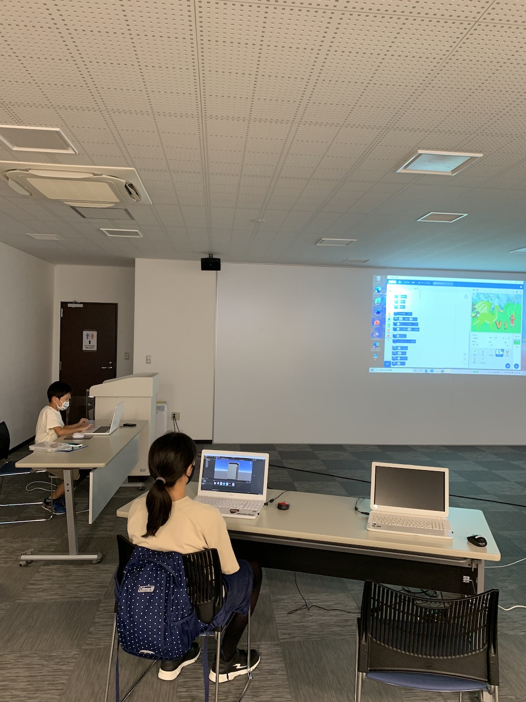
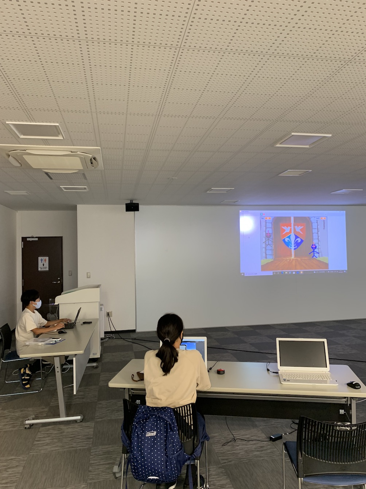
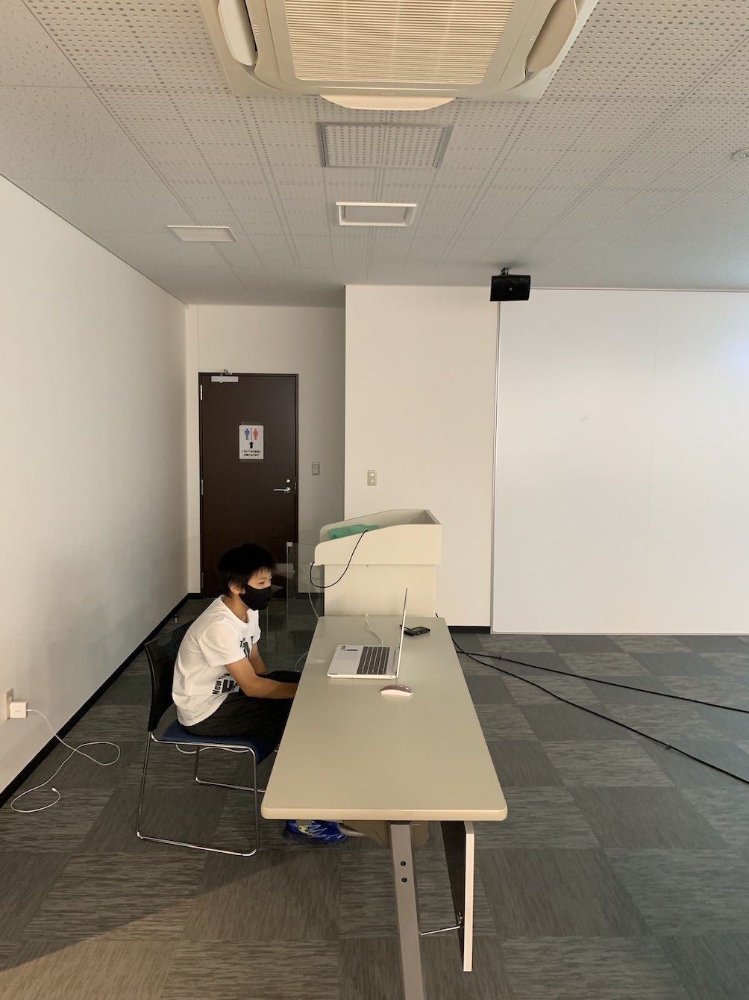
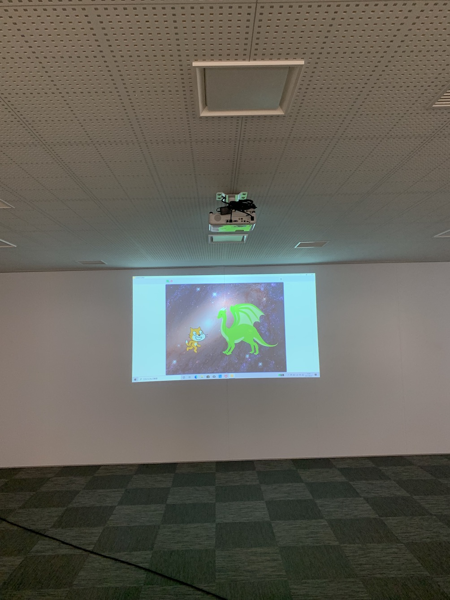

[子ども向けプログラミング道場：コーダー道場 46 回目 @大阪狭山](https://coderdojo-hommachi.doorkeeper.jp/events/124789)

`3`名の **メンター** と`7`名の **ニンジャ** が集まりました。

会場は「[UP っぷ（子育て支援・世代間交流センター）](http://www.city.osakasayama.osaka.jp/kosodate_kyoiku/kosodate/upp_kosodatesiensedaikankouryuusenta1/index.html)」にて開催させていただきました。

## 当日のスケジュール ⏰

| 時間                   | 内容                         |
| ---------------------- | ---------------------------- |
| 10:00 - 10:10 (10 min) | オープニング                 |
| 10:10 - 11:10 (60 min) | プログラミング & 図工        |
| 11:10 - 11:20 (10 min) | 休憩                         |
| 11:20 - 12:10 (50 min) | プログラミング & 図工 の続き |
| 12:05 - 12:30 (25 min) | 作品発表                     |
| 12:30 - 12:35 (5 min)  | クロージング & 交流タイム    |

## レポート 📝

### オープニング

去年はできなかった夏休みの工作イベントを開催しました。広い会場なのでプログラミングと併設できます。

図工の島も少人数で距離を保つようにしています。どんなのができるか大人たちは気になっています。

### プログラミング

初めての参加者には小さなユースメンターがサポートしてくれています。（もう友達になってそう。）

### 図工の時間

図工はドット絵遊びです。Scratch で絵を描くようにビーズを並べて作品を作ります。

アイロンビースに UV レジンを着けてモールドに並べてドット絵を完成させます。（爪楊枝の二刀流）

この状態で UV ライトを当てると固まるので完成です。（アイロンは使いません。）

### 作品発表

#### 発表１

メンターがドット絵遊びのモールドの作り方を説明しています。

Fusion 360 でモデリングをして、UV レジンの 3D プリンターで出力しています。

#### 発表２

初めて Scratch をインストールして、初めてのプログラミングです。

ドラゴンとバッターが戦うアクションゲームです。（Scratch は標準に使いやすい素材がたくさんありますね。）

#### 発表３

Scratch の対戦ゲームです。こちらは標準でないスプライトや背景の絵を使っています。

丸い玉が出て攻撃をします。これから攻撃のバリエーションが増えそうです。

#### 発表４

Fusion 360 でイヤホンの部品をモデリングしています。

新しく覚えたモデリングの機能も紹介してくれました。

#### 発表５

Scratch のクローンを実験しています。画面いっぱいに猫とドラゴンが現れます。

猫とドラゴンはゲームでもありそうなタイトルですね。

#### 発表６

Scratch の野球のアニメーションです。前回は野手にキャッチしてアウトでしたが、

今回はセーフになるパターンです。今度は 1 塁にランナーが出ていそうな予感です。

#### 図工展示

ドット絵遊びの作品です。

エンチャントされてそうなソードです。

クリアのビーズを使ったソードです。

全体にクリアを使っています。（青以外はレジンでもよかったのかも）

稲妻の剣のようでかっこいいです。

ダイヤモンドのピッケルです。

このピッケルもクリアが使われています。（クリアは人気です。）

### クロージング

ソードとピッケル以外にもハートがありましたが、ハートの出番はなかったです。

でかドージョーをするときにはモールドをたくさん用意して、みんなで遊べるようにしたいです。

