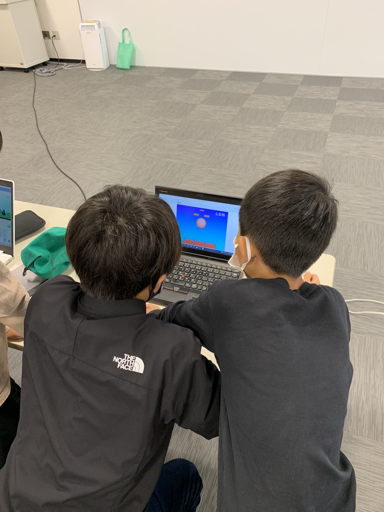
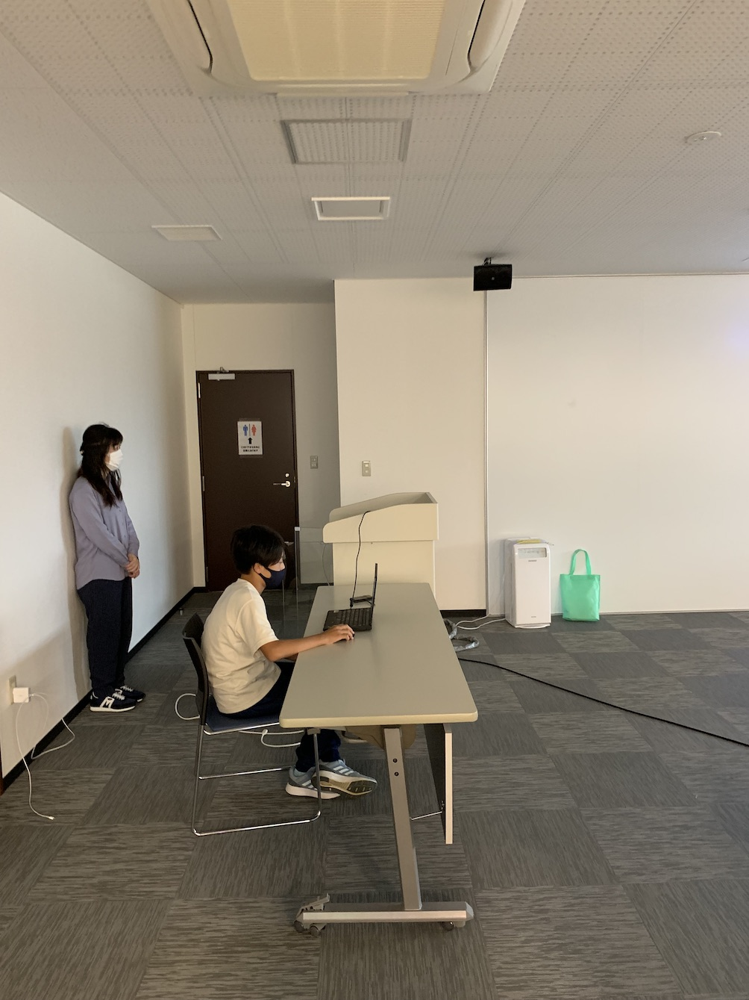

[子ども向けプログラミング道場：コーダー道場 48 回目 @大阪狭山](https://coderdojo-hommachi.doorkeeper.jp/events/127497)

`3`名の **メンター** と`10`名の **ニンジャ** が集まりました。

会場は「[UP っぷ（子育て支援・世代間交流センター）](http://www.city.osakasayama.osaka.jp/kosodate_kyoiku/kosodate/upp_kosodatesiensedaikankouryuusenta1/index.html)」にて開催させていただきました。

## 当日のスケジュール ⏰

| 時間                   | 内容                                   |
| ---------------------- | -------------------------------------- |
| 10:00 - 10:10 (10 min) | オープニング                           |
| 10:10 - 11:10 (60 min) | プログラミング & ワークショップ        |
| 11:10 - 11:20 (10 min) | 休憩                                   |
| 11:20 - 12:00 (40 min) | プログラミング & ワークショップ の続き |
| 12:00 - 12:25 (25 min) | 作品発表                               |
| 12:25 - 12:30 (5 min)  | クロージング & 交流タイム              |

## レポート 📝

### オープニング

いろんな地域のイベントがオンサイトで開催できるようになってきています。今回は参加者が多いです。

市民のイベントも中止が続いてきましたが来年からは開催できそうです。ワークショップで参加の申し込みをします。

### プログラミング

うちで作ってきた作品をだれかと遊んでもらう場所としてもオンサイトの開催は必要です。

鍵の中身を見せてくれました。作ってみて気付くことも多いので、真似て作ることも大切です。

保護者の方もメンターのようにサポートされています。ありがとうございます。

### ワークショップ

プログラミングでポケモンをうごかしてみよう は準備ができた参加者から開始するスタイルにしました。

小学校で Scrach を経験している参加者は **ピカチュウを歩かせよう** なら 5 分程度で完成します。

なので **ポケモンをゲットしよう** で自由にプログラミングを楽しめる時間を多くするほうがよさそです。

### 作品発表

#### 発表１

Fusion 360 でダイヤル式の鍵をモデリングしました。YouTube で構造を紹介する動画を参考にしたそうです。

ライブでダイヤルの作り方の紹介してくれました。外観の色も良い感じで使いこなしています。

#### 発表２

Scrach の **ねこにげ** のようなアクションゲームです。サメにあたるとヒトデの表情が変わります。

サメの動きがはやいので、スペースキーでサメに稲妻を落として、サメが痺れているあいだに逃げます。

#### 発表３

Scrach のアクションゲームです。ガイコツがアイアンマンのビームを避けます。

ビームは手書きですが、ゲーム内のスケールで発射されると良い感じです。

#### 発表４

プログラミングでポケモンをうごかしてみよう の **ポケモンをゲットしよう** のアレンジです。

Scrach カードの ピンポンゲーム をヒントに、モンスターボールが跳ねて自動でポケモンをゲットします。

#### 発表５

Scrach の横スクロールのアクションゲームです。タイマーブロックでクリアタイムの機能が追加されました。

背景と同じ白い蝶々も追加したので、クリアタイム前にゲームオーバーになる難易度でした。

#### 発表６

メンターのイベント紹介です。コーダー道場で市民祭に参加を申し込んでみます。

[Coolest Projects 2021](https://online.coolestprojects.org/) を紹介しました。[マレーシア開催](https://coolestprojectsmalaysia.com/)が受付中です。

[ヒーローズリーグ 2021](https://heroes-league.net/) を紹介しました。こちらも応募期間中です。

### クロージング

市のマスコットキャラクターをプログラミングや工作で使えるように利用許可を申請しています。

12 月の開催は発表大会を企画します。将来は Coolest Projects にも応募できるとよいですね。
