[子ども向けプログラミング道場：コーダー道場 49 回目 @大阪狭山](https://coderdojo-hommachi.doorkeeper.jp/events/128818)

`2`名の **メンター** と`3`名の **ニンジャ** が集まりました。

会場は「[UP っぷ（子育て支援・世代間交流センター）](http://www.city.osakasayama.osaka.jp/kosodate_kyoiku/kosodate/upp_kosodatesiensedaikankouryuusenta1/index.html)」にて開催させていただきました。

## 当日のスケジュール ⏰

| 時間                   | 内容                      |
| ---------------------- | ------------------------- |
| 10:00 - 10:10 (10 min) | オープニング              |
| 10:10 - 11:10 (60 min) | プログラミング            |
| 11:10 - 11:20 (10 min) | 休憩                      |
| 11:20 - 12:00 (40 min) | プログラミング の続き     |
| 12:00 - 12:25 (25 min) | 作品発表                  |
| 12:25 - 12:30 (5 min)  | クロージング & 交流タイム |

## レポート 📝

### オープニング

感染拡大対策が緩和されて会場の利用人数や名簿提出などが無くなり運営側の負担が軽くなりました。まだ会場では飲食はできないです。（ロビーは OK）

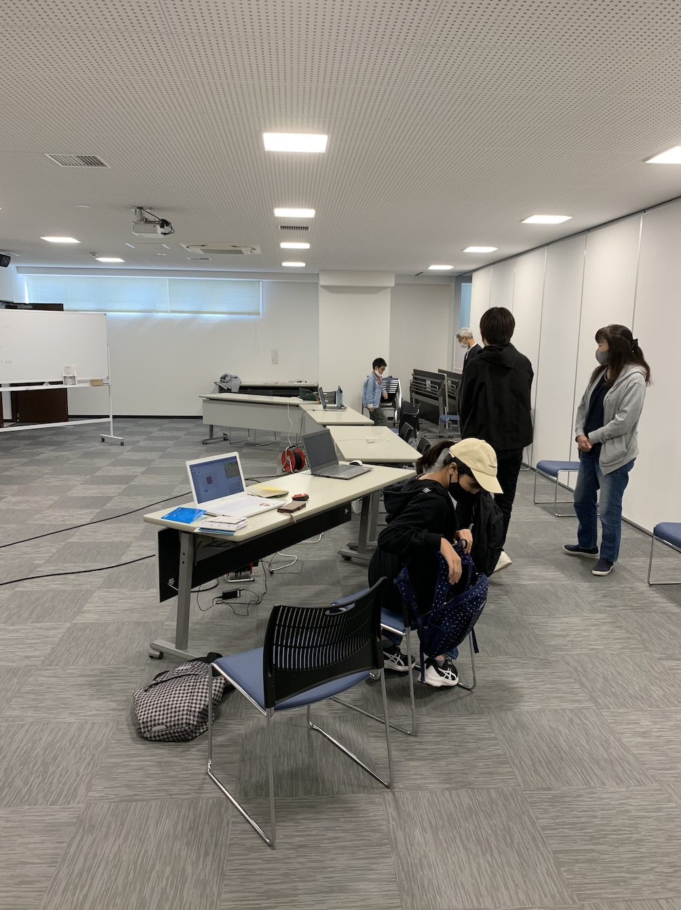

[46 回目](/blog/2021-08-22-report1/)の図工のソードにヒートンを取り付けて、アクセサリーにした展示です。`さやりん` のアクセサリーは新作です。

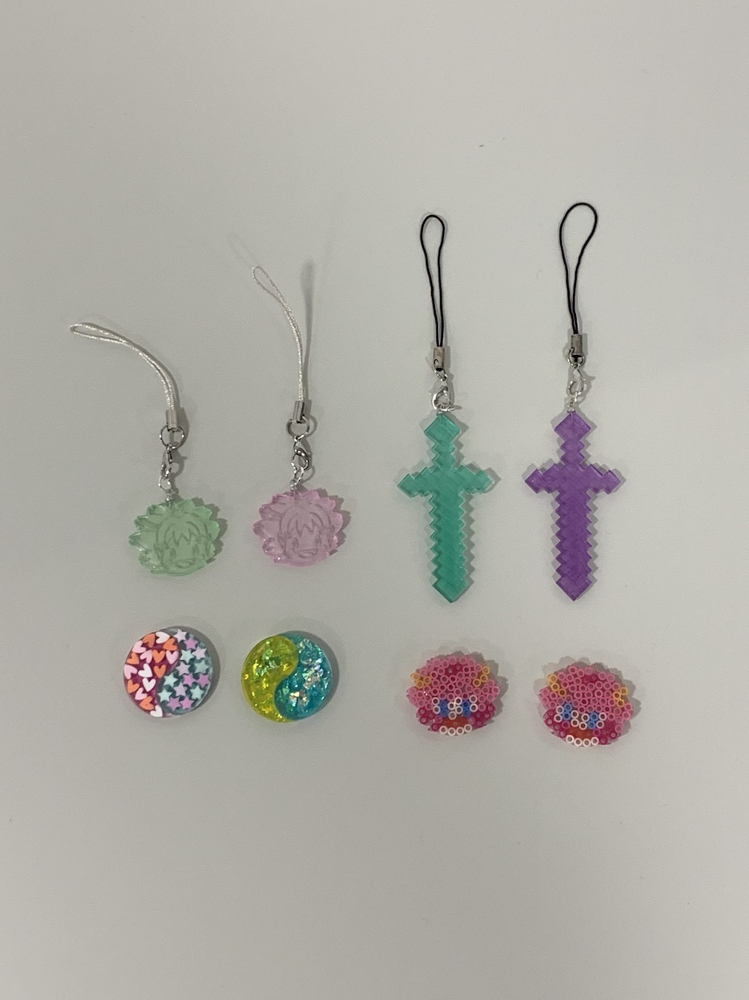

### プログラミング

学校で `Excel`(表計算ソフトウェア) の関数を使用する授業があったそうです。

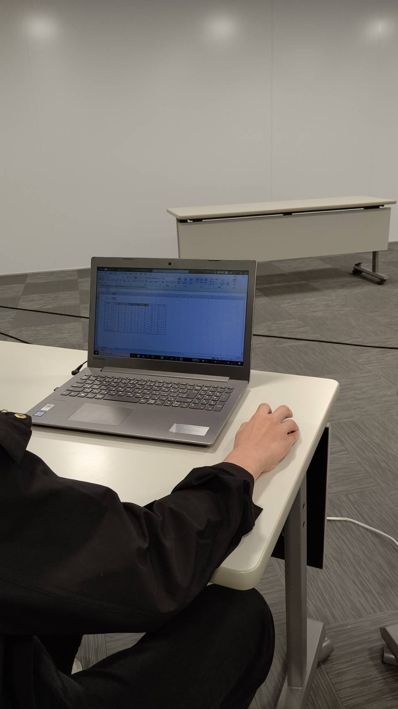

iPhone の `アイビスペイントX`(お絵かきアプリ) で葉っぱイラストを描いています。

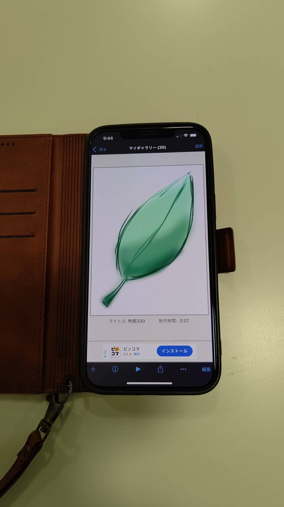

`アイビスペイントX` は描く道具や太さが色々選べます。

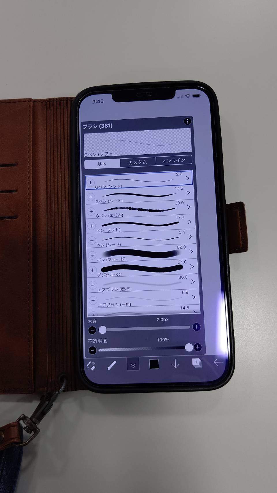

### 作品発表

#### 発表１

Fusion 360 で好きな数字を自由できるサイコロをモデリングしました。

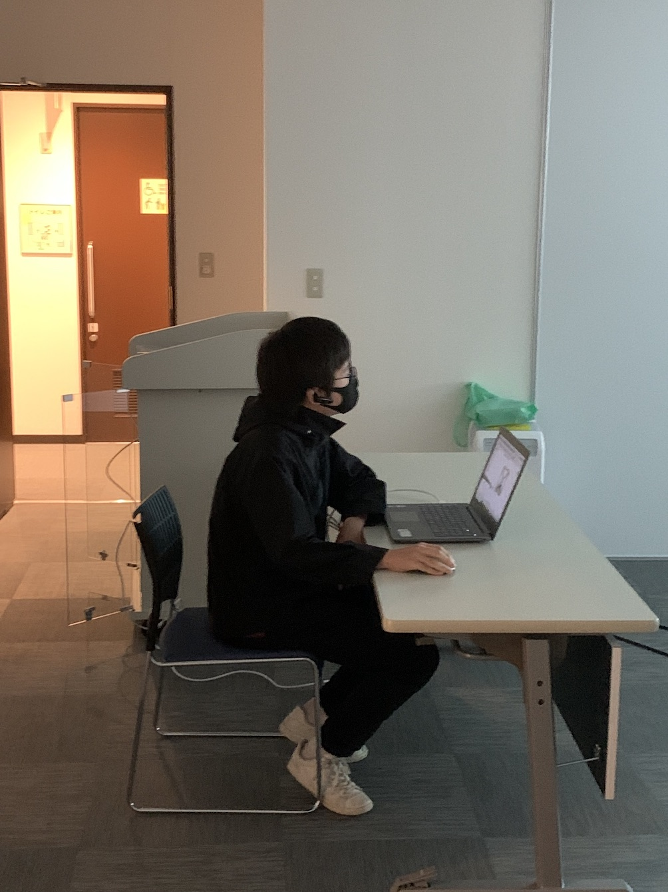

ベースのキューブにパレットをパチパチと取り付けます。パレットを外す道具も作っています。

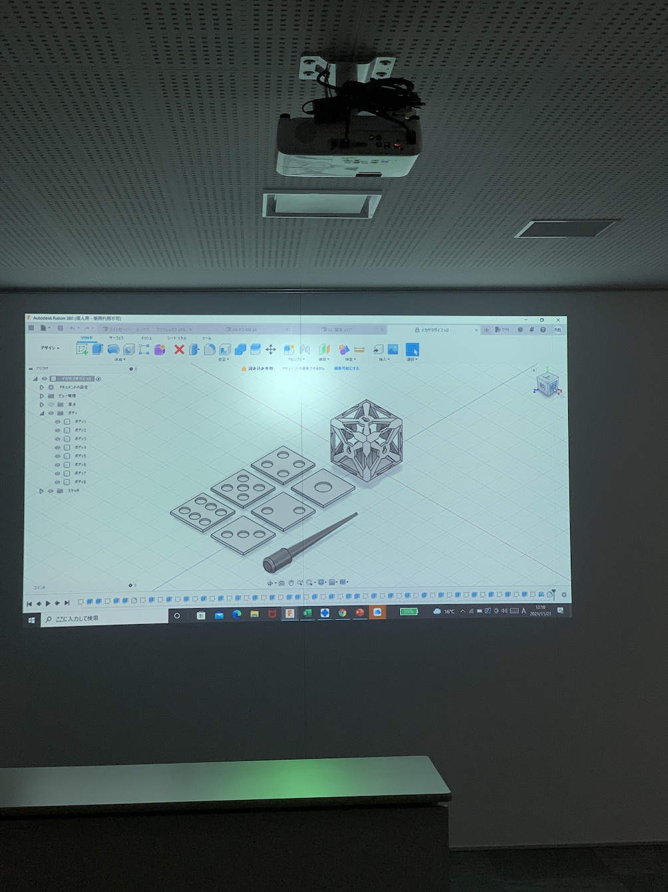

#### 発表２

Scrach の アニメーションです。カエルが虫をパクッとします。

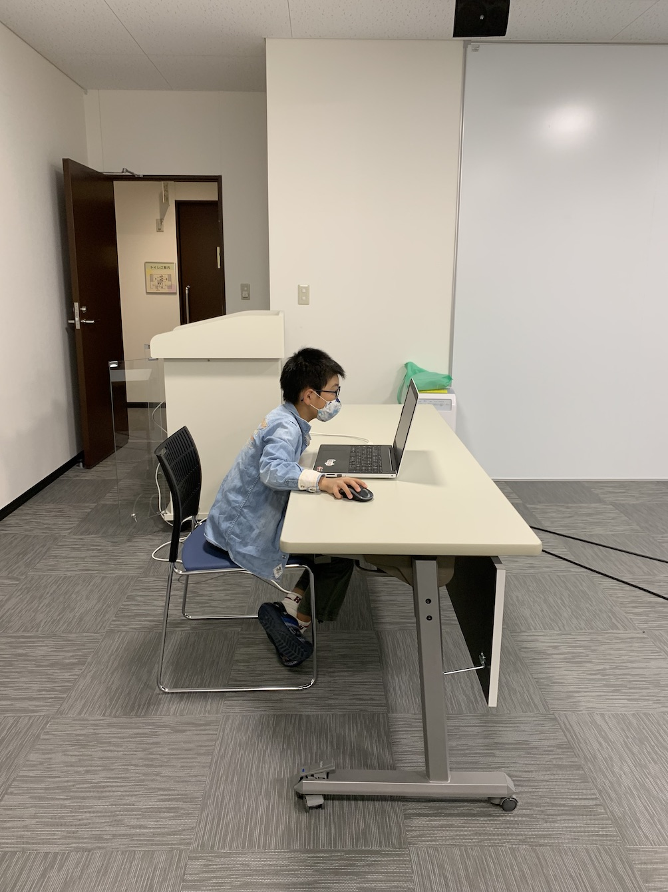

ゲコゲコと泣きながら左右に動いて虫を食べています。

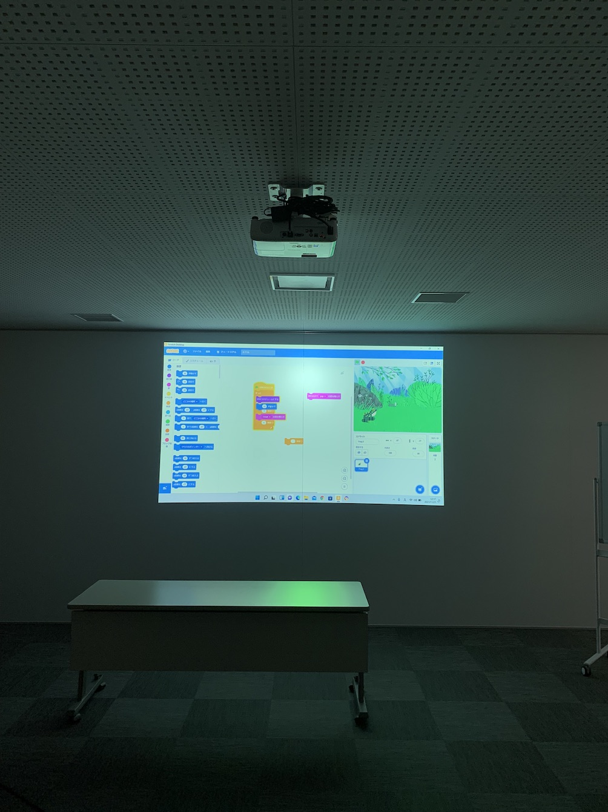

Frog2 のスプライトが舌で虫を食べるアニメーションだと知りました。（それに Frog2 はリアルですね。）

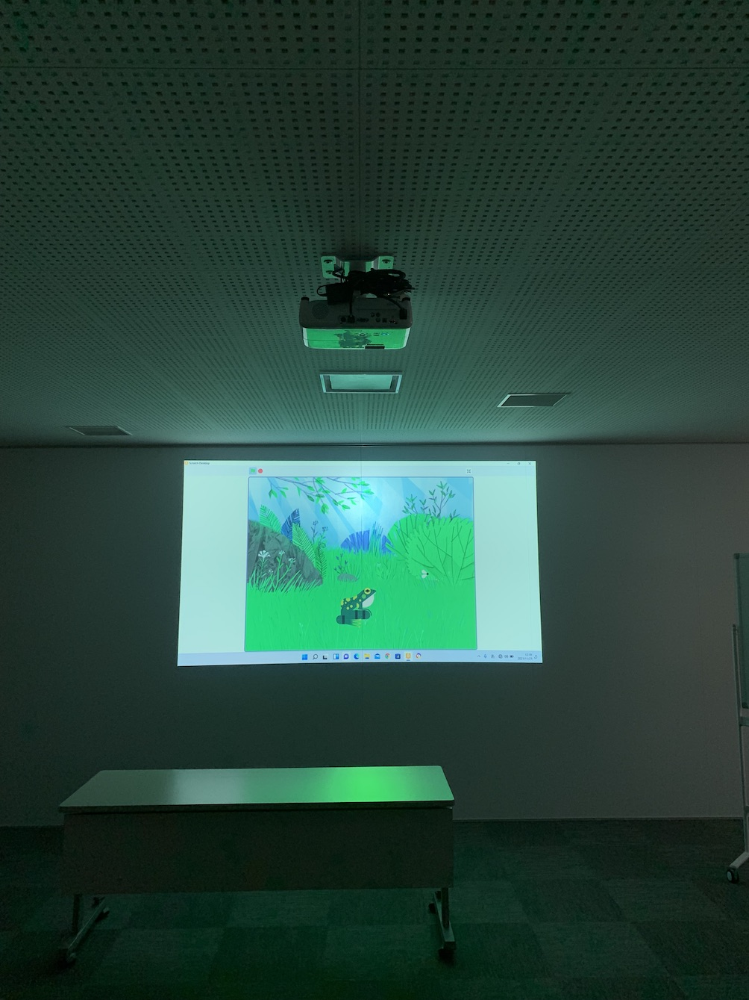

#### 発表３

メンターのレジンアクセサリーの発表です。大阪狭山市のマスコットキャラクターの `さやりん` をイベントで利用する許可を得ることができました。

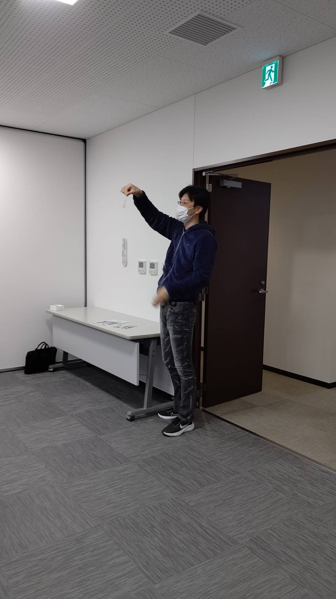

コーダー道場を開催させて頂いている会場で、レジンアクセサリーのイベントの開催が決まりました。

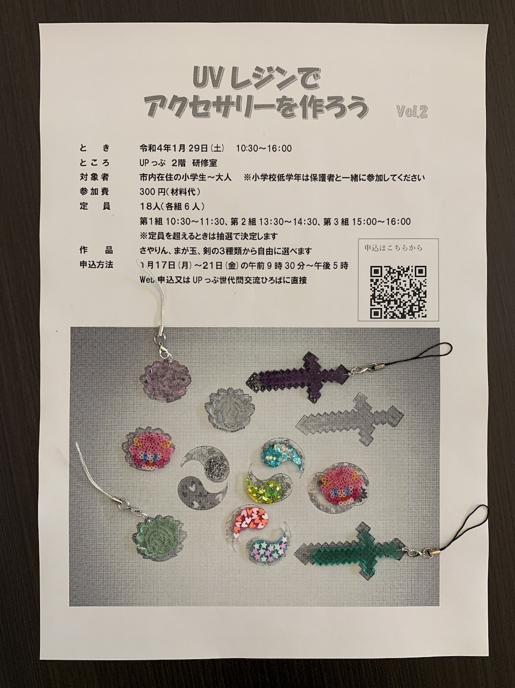

### クロージング

12 月は発表大会のコンテストを開催します。当日にエントリーできるように準備をしておきましょう。

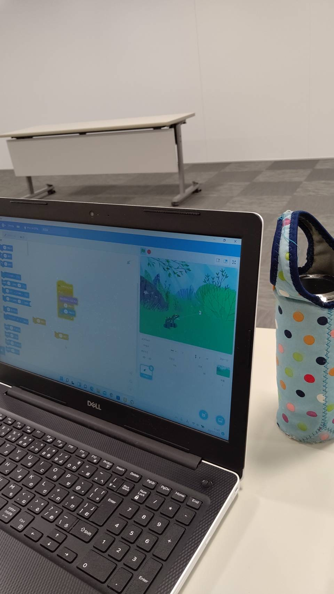
