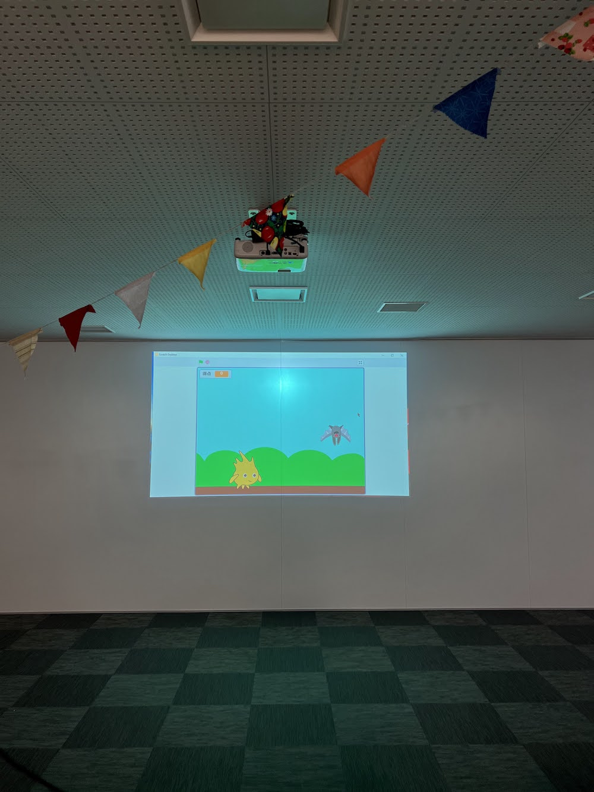

[子ども向けプログラミング道場：コーダー道場 50 回目 @大阪狭山](https://coderdojo-hommachi.doorkeeper.jp/events/130114)

`3`名の **メンター** と`9`名の **ニンジャ** が集まりました。

会場は「[UP っぷ（子育て支援・世代間交流センター）](http://www.city.osakasayama.osaka.jp/kosodate_kyoiku/kosodate/upp_kosodatesiensedaikankouryuusenta1/index.html)」にて開催させていただきました。

## 当日のスケジュール ⏰

| 時間                   | 内容                      |
| ---------------------- | ------------------------- |
| 10:00 - 10:10 (10 min) | オープニング              |
| 10:10 - 11:00 (50 min) | 発表準備                  |
| 11:00 - 12:00 (60 min) | 発表大会                  |
| 12:00 - 12:10 (40 min) | コンテスト受賞            |
| 12:10 - 12:20 (25 min) | プレゼント大会            |
| 12:30 - 12:35 (5 min)  | クロージング & 交流タイム |

## レポート 📝

### オープニング

今回で開催 50 回目なのでハーフアニバーサリーです。ガーランドがたくさん飾られていてお祭りみたいです。

こちらの会場は `子育て支援・世代間交流センター` です。子供たちが楽しめるイベントをいろいろ開催しています。

前日にクリスマスのイベントがあって **CoderDojo** ためにそのままに飾って頂きました。とてもかわいいです。

オライリー様からの書籍寄贈が `CoderDojo大阪狭山` に届きました。ありがとうございます。

### クリスマス飾り

会場の飾りを少し紹介します。奥の大きなクリスマスツリーの飾りです。後ろのヒヨコもかわいいです。

小さなクリスマスツリーもあります。奥には大きなヒヨコがいます。（子育て支援センターなのでヒヨコが人気です。）

壁の色ガラスにも手作りの飾りがあって、素敵なクリスマスのイベントの様子が思い浮かびます。

### プレゼント

クリスマスのプレゼントです。（ [Scratch ではじめる機械学習](https://www.oreilly.co.jp/books/9784873119182/) はオライリー様からの書籍寄贈とは別の本です。）

今年はオリンピックイヤーなので 金、銀、銅（ピングゴールド）のメダルがコンテストで授与されます。

ステンレスの水筒は子供たちの人数分あります。お菓子の詰め合わせのプレゼントも保護者の方からの提供です。

何がもらえるか興味津々です。（ガーランドがかわいいです。）

### 発表大会

ホワイトボードに 1〜20 の番号を書いていて、発表したい順番に名前を書いています。（子供たちは全員参加してます。）

#### 発表１

保護者の方も発表大会に参加できます。家で本を参考にして作品を作っています。

Scrach のアクションゲームです。敵の攻撃を避けながら進みます。

ゴールをするとクリスマスの背景になります。季節をモチーフにするところは _さすが_ です。

#### 発表２

iPhone のアプリの [Medly](https://apps.apple.com/jp/app/medly/id940268124) で 作曲 した作品です。とてもポップないい感じの曲です。

将来は音楽とイラストとプログラミングで役割を分担して作品がつくれそうです。

今回初登場の書画カメラです。手元が大きく写せて距離を保つ発表ができます。（設備が充実していてすごいです。）

#### 発表３

[Fusion 360](https://www.autodesk.co.jp/products/fusion-360/overview) のモデリングの作品です。アニメのオリジナルグッズだそうです。

旭日章（きょくじつしょう）は５角形の 1 箇所を作って、4 箇所にコピーして作っています。（デモがありました。）

作品は `名探偵コナン 警察学校編 警察学校組バッチ` です。警察学校組の 5 人の名前が入っています。

#### 発表４

[Unity](https://unity.com/ja) の パチンコ台の作品です。マウスをクリックすると大量のボールが弾き出されて落ちていきます。

アタッカーにいい感じにボールが入るようになっています。物理演算がよいです。

Unity は C# というプログラミング言語で作成しています。（大人たちは木の箱に釘を打って作っていたそうです。）

#### 発表５

未来の車の紹介です。水素と酸素から発電をしてモーターで走る [MIRAI](https://toyota.jp/mirai/) です。

ガソリン車のような排気ガスが出ないので、車の後ろにはマフラーはありません。

水素と酸素から水ができるので、車体の下から水がでるそうです。（水の化学式 覚えていますか？）

#### 発表６

Scrach のクレーンゲームです。３つのプレゼントが並んでします。

キー操作でアームを移動します。カゴまで落とさずに移動すると成功します。

アームで掴んで、持ち上げて、カゴに入れるまでの動作が再現されています。

#### 発表７

Scrach のアクションゲームです。開発は始まったばかりのようです。

剣を振ったり、ジャンプしたり多彩なアクションがあります。

スプライトもたくさん用意していて、未使用の絵もあるそうです。今後の機能拡張に期待できそうです。

#### 発表８

Scrach の脱出ゲームです。`プログラミングでポケモンをうごかしてみよう` のアレンジの作品です。

ピカチュウがモンスターボールを避けながら、鍵をとって、ドアを開けてイーブイを助けます。

利用規約でキャラクターの画像はこのブログには使えませんが、イーブイは無事に脱出できています。

#### 発表９

Scrach の[小中学生からはじめるプログラミングの本](https://www.nikkeibp.co.jp/atclpubmkt/book/17/260830/)の紹介です。

シューティングのゲームです。左右の移動でスプライトの角度を傾けると飛んでいる感じになります。

ユースメンターなので困っていたら声をかけてくださいの告知がありました。（たのもしいです。）

#### 発表１０

今年に Scrach で作った２つの作品です。この作品がお気に入りのようです。

`プログラミングでポケモンをうごかしてみよう` の `ポケモンをゲットしよう` です。

カエルがハエを食べるアニメーションです。(Scrach の標準のカエルはアニメ風とリアル風の２種類あります。)

#### 発表１１

前日にメンターが [DojoCon Japan 2021](https://dojocon2021.coderdojo.jp/) に参加していたので、そのイベントの紹介です。

DojoCon は全国から CoderDojo コミュニティが集まるカンファレンスです。今年もオンラインの開催でした。

[oVice](https://ovice.in/) で素敵なバーチャル空間が準備されていて、物理的な距離があっても会えたような感じになります。

### コンテスト

参加者が発表者の番号（２つ違うの数字）を書いて投票しました。今回は１位から３位までのみを発表しています。

１位から３位まで順番に好きなプレゼントを選べます。そして金、銀、銅（ピングゴールド）のメダルが授与されます。

子供達は 1 番を目指しているわけではないかもしれないけれど、讃えられるのは嬉しいかもしれない。 
機械学習の本を選ぶとは _さすが_ です。どんな作品ができるか楽しみです。

にゃんこ大戦争のグッズも人気です。ポノス様ありがとうございます。(白と黒がそろったのかも)

ライト付きのモバイルバッテリーは初めから気になっていたようです。WordCamp に参加したとき頂いたものです。

### プレゼント大会

発表者で抽選をして順番にプレゼントを選びました。`さやりん`アクセサリーもプレゼントです。

[テクノ図工部](https://www.tekunozukoubu.net/) からの [LED ランタン](https://www.tekunozukoubu.net/2020/12/08/%e3%83%86%e3%82%af%e3%83%8e%e5%9b%b3%e5%b7%a5%e9%83%a8-vol-11-%e6%b4%bb%e5%8b%95%e3%83%ac%e3%83%9d%e3%83%bc%e3%83%88/) です。 minne のステッカーも気になっていたようです。(手作りが好きなのかな)

マラソンの５本指の靴下です。タビオ様ありがとうございます。

剣道の練習前なのかな（コーダー道場の名前の由来は剣道の道場から発想したと ビル・リャオ さんが言っています。）

大人たちも抽選をして順番にプレゼントを選びました。プレゼント大会前に用事で帰った子にもちゃんと渡せています。

### クロージング

メダルは [DojoCon Japan 2017](https://dojocon2017.coderdojo.jp/) に参加したときに展示したものを子供たちでも作れるようにしています。
いつかオンサイトで DojoCon ができるようになれば企画したいと思います。それまでは DecaDojo など地域のイベントで開催します。

子供たちから「発表大会 楽しかった、またあるの？」と話をしてくれたので次回の約束をしました。 
この子供たちとの約束が、時間が続いていってほしいと思います。
