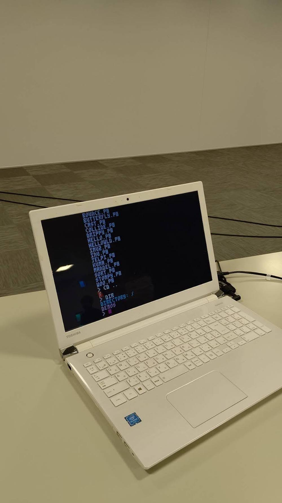
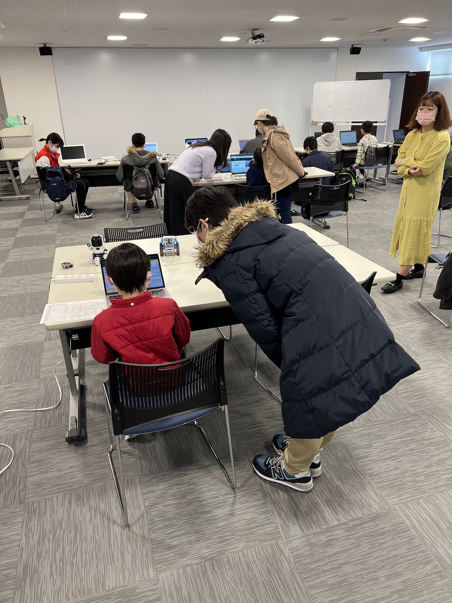
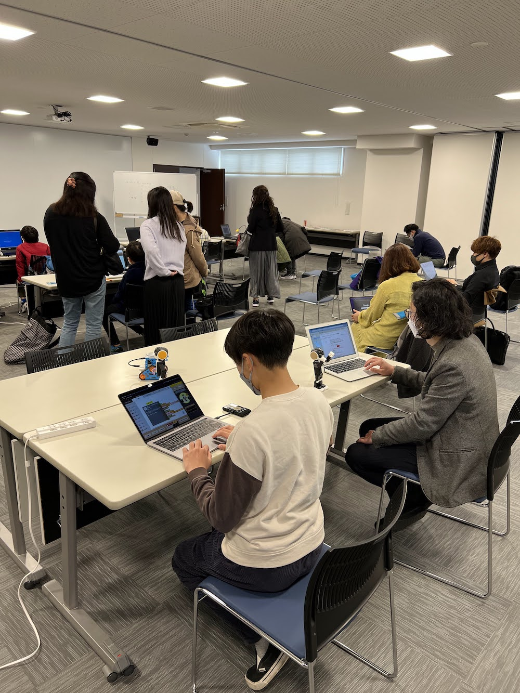

[子ども向けプログラミング道場：コーダー道場 53 回目 @大阪狭山](https://coderdojo-hommachi.doorkeeper.jp/events/133989)

`5`名の **メンター** と`10`名の **ニンジャ** が集まりました。

会場は「[UP っぷ（子育て支援・世代間交流センター）](http://www.city.osakasayama.osaka.jp/kosodate_kyoiku/kosodate/upp_kosodatesiensedaikankouryuusenta1/index.html)」にて開催させていただきました。

## 当日のスケジュール ⏰

| 時間                   | 内容                  |
| ---------------------- | --------------------- |
| 10:00 - 10:10 (10 min) | オープニング          |
| 10:10 - 11:00 (50 min) | プログラミング        |
| 11:00 - 11:10 (10 min) | 休憩                  |
| 11:20 - 12:00 (40 min) | プログラミング の続き |
| 12:00 - 12:25 (25 min) | 作品発表              |
| 12:25 - 12:30 (5 min)  | クロージング          |

## レポート 📝

### オープニング

小学生、中学生は春休みに入っています。初参加のメンターやゲストメンターも来て普段より多い参加者です。

参加者に持ってきてもらった本です。どんなゲームが作りたいのでしょうか？

メンターの展示です。電池ホルダーがかわいいです。（推しの漢字が光っています。）

### プログラミング

Roblox や Scratch でプログラミングをしています。

micro:bit で フォロ という 6 足歩行ロボット のプログラミングをしています。

ロブリック で ロボホン という 2 足歩行ロボット のプログラミングをしています。

PICO-8 でクラッシックなゲームのプログラミングをしています。

Unity でスマートボールのプログラミングをしています。

ロボ島の奥では Fusion 360 のインストールをフォローしています。

### ロボ島

ロボットで遊ぶなら広い机があるとよいので、ロボ島を準備しています。

カムロボ や ロボホン x 2 や フォロ で賑やかな ロボ島です。（ロボホンはエンチャントピッケルを持っています。）

ロブリック で ロボホン をプログラミングで動かす体験ができます。ロブリック は JavaScript でもプログラミングができます。

カムロボは mruby でプログラミングができます。体験会はいつか開催したいです。

### メンター紹介

`CoderDojo五反田` からメンターで参加して頂きました。ロボ島を観て頂きました。

初参加のメンターです。オンサイトのイベントに参加するために遠くから来て頂きました。

### 作品発表

#### 発表１

メンターからロブリックの説明です。ロボホン は CoderDojo の説明を話してくれます。

`３D プリント コンテスト` の表彰式イベントの紹介です。プロダクト部門で受賞しました。

CoderDojo でも開催したミニビーズでドット絵を立体にする遊びです。その樹脂型の提案です。

#### 発表２

続いても `３D プリント コンテスト` の表彰式イベントの紹介です。`CoderDojo大阪狭山` で W 受賞です。

以前に発表してくれた ライトセイバー で受賞です。コンテストはメンターのサポートがあったようです。

賞品で ライトセイバー の光刃を作るようです。光る部分は電子工作でしょうか。

#### 発表３

Roblox のレースゲームです。デイトナ・インターナショナル・スピードウェイというコースを再現しています。

ミッションの車なので、クラッチの操作をしないと車は進みません。変速もプログラミングされています。

時間で太陽の位置が変わり、変わり太陽が沈むと車のライトが光るプログラミングに挑戦しています。

#### 発表４

Scratch のシューティングゲームです。マウスの方に弾がでます。

恐竜に当たればポイントアップして、タイマーが０になるとランキングに登録されます。

ランキングはリストを使っプログラミングをしています。

#### 発表５

Scratch の対戦ゲームをアップデートしました。

キャラクターで強さが違うので、攻撃が当たった時の HP の減り方が違います。

攻撃の方法はキャラクターに合わせて個性的です。（現実世界ではボールを人に当ててはいけません。）

### クロージング

会場の予約が半年から 1 年に伸びたので、ずっとポスターが貼られます。（基本は第３日曜日に開催します。）

会場の近くの桜です。今は蕾ですが咲くのが楽しみです。

