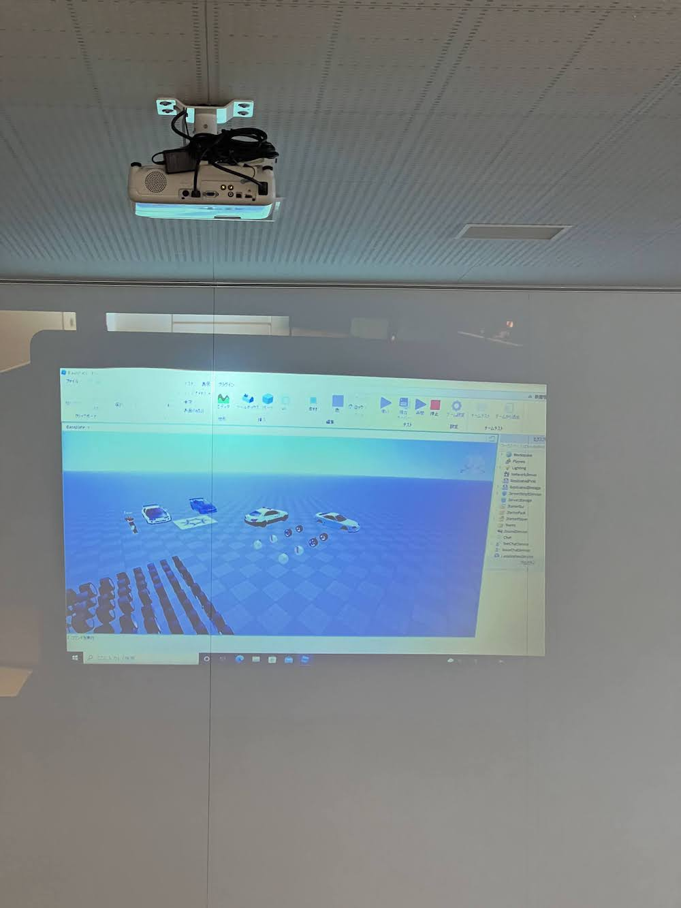
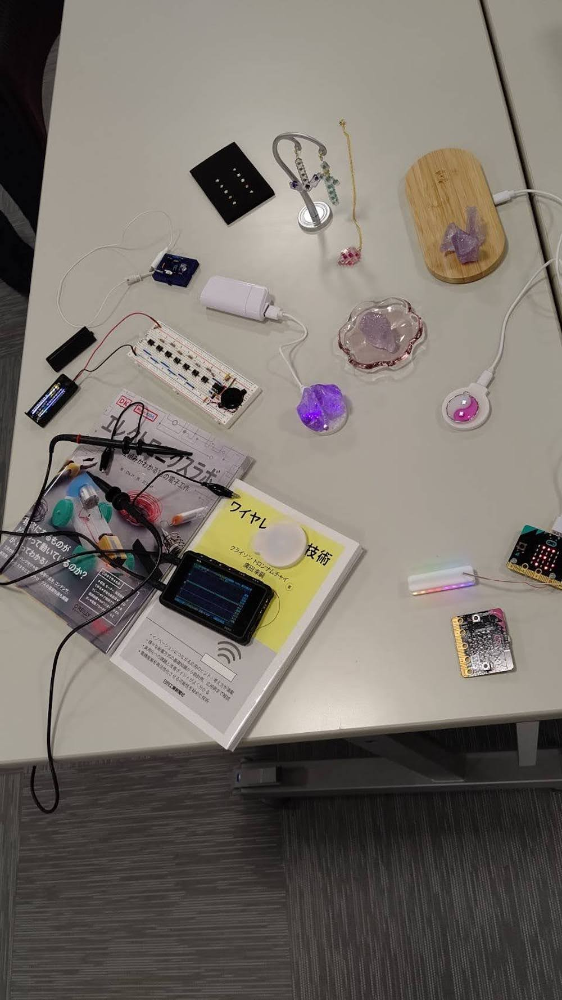

[子ども向けプログラミング道場：コーダー道場 54 回目 @大阪狭山](https://coderdojo-hommachi.doorkeeper.jp/events/135372)

`3`名の **メンター** と`9`名の **ニンジャ** が集まりました。

会場は「[UP っぷ（子育て支援・世代間交流センター）](http://www.city.osakasayama.osaka.jp/kosodate_kyoiku/kosodate/upp_kosodatesiensedaikankouryuusenta1/index.html)」にて開催させていただきました。

## 当日のスケジュール ⏰

| 時間                   | 内容                  |
| ---------------------- | --------------------- |
| 10:00 - 10:10 (10 min) | オープニング          |
| 10:10 - 11:00 (50 min) | プログラミング        |
| 11:00 - 11:10 (10 min) | 休憩                  |
| 11:20 - 12:00 (40 min) | プログラミング の続き |
| 12:00 - 12:25 (25 min) | 作品発表              |
| 12:25 - 12:30 (5 min)  | クロージング          |

## レポート 📝

### オープニング

新しい学年になっての開催です。4月は初めての参加者が多い月です。(新中学生や新高校生も参加しています。)

新高校1年生が学校の教材の [Python入門](https://project.nikkeibp.co.jp/bnt/atcl/yy/S70170/) を持ってきてくれました。 (大阪狭山は Ruby をサポートしています。)

[do your :bit](https://microbit.org/ja/projects/do-your-bit/) の説明をするので 電子工作島 を用意しました。

### プログラミング

[小学生からはじめるプログラミングの本](https://www.nikkeibp.co.jp/atclpubmkt/book/22/285320/) を見ながらプログラミングをしています。 

新高校生のユースメンターズがサポートしています。(奥にも人だかりはなんだろう？)

見たことがあるような丸と三角の組み合わせです。ふすまの雰囲気にも見覚えがあります。

こちらも見たことがあるような丸と三角の組み合わせです。(ねこのゲームが流行っているようです。)

フォロ という 6 足歩行ロボット は赤外線で左右に動くプログラミンをしています。

初参加のニンジャにはユースメンターがペアで対応しています。

タブレットで調べながらプログラミングをしています。(教科書は電子化に進んでいるようです。)

### 電子工作島

電子工作島では micro:bit のプログラミングの体験ができます。

micro:bit で NeoPixel のプログラミングをしています。(レインボーに光って綺麗です。)

micro:bit は Scratch と同じブロックのインタフェースなので、すぐにプログラミングができます。

micro:bit の体験は順番に一人ずつ 電子工作島 でプログラミングをします。

### 作品紹介

[エレクトロニクスラボ ものの仕組みがわかる18の電子工作](https://www.oreilly.co.jp/books/9784873119243/) の電子オルガン です。

ワイヤレス給電の 光る天然石 と 光るCoderDojo のロゴです。

ワイヤレス給電の装置は充電ができるので、ワイヤレスのワイヤレスで給電することができます。

不思議なブレッドボードの回路は 1.5v の電池で LED が光ります。

前回の発表でコンテストに入賞した作品です。(作りたい子供が多いので、このワークショップは今年にしたいです。)

### 作品発表

#### 発表１

メンターが micro:bit のコンテストの [do your :bit](https://microbit.org/ja/projects/do-your-bit/) の説明をしています。

2022年7月15日(金)12:00pm(イギリス時間)までが締め切りです。

電子工作島の展示している micro:bit の NeoPixel の作品の紹介です。(こちらは過去に受賞しています。)

グローバル目標を考えるよい機会なので、チャレンジしてもらえると嬉しいです。

#### 発表２

Scratch のネコのアクションゲームの設計です。作りたい機能の説明をしています。

ふすまの模様はよくみるとフリーハンドで描かれていて、凝っています。

#### 発表３

Scratch のネコのアクションゲームです。ネコのアクションはメニューから選択します。

敵は毒針を使ってきます。攻撃の名前を吹き出しで喋っている感じが好きです。

体力を回復したいときは昼寝を選びます。敵の体力がなくなるとクリアが表示されます。

#### 発表４

Roblox で車の作り方の説明です。前回は レースコースを紹介してくれました。

シャーシにタイヤを取り付けます。ボティは Blender で描いているそうです。

今回はドリフト仕様に仕上げての実演です。めっちゃ煙がでています。

ドリフト仕様なので車重を軽くしたり、マニュアルトランスミッションにしたりするプログラミングのコードです。

### 機材紹介

PCのプロジェクターの接続がうまくいかないときは書画カメラの利用をします。

いろんな設備が揃っていて、とても助かります。(マイクを準備していたのに使うのを忘れていました。)

電子工作島で子供たちにハンダコテと言われた物はオシロスコープです。(電子部品に当てるものだから形状は似てますね。)

### クロージング

次回の大阪狭山の開催の前日に **CoderDojo Camp** を南吹田の琥珀街で屋外のイベントを開催します。
詳しくは[こちら](https://coderdojo-osakasayama.doorkeeper.jp/events/136008)を参照して下さい。

