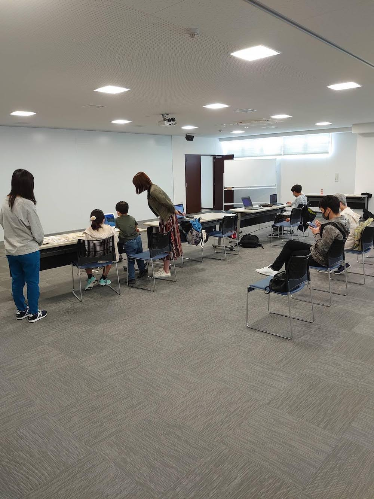
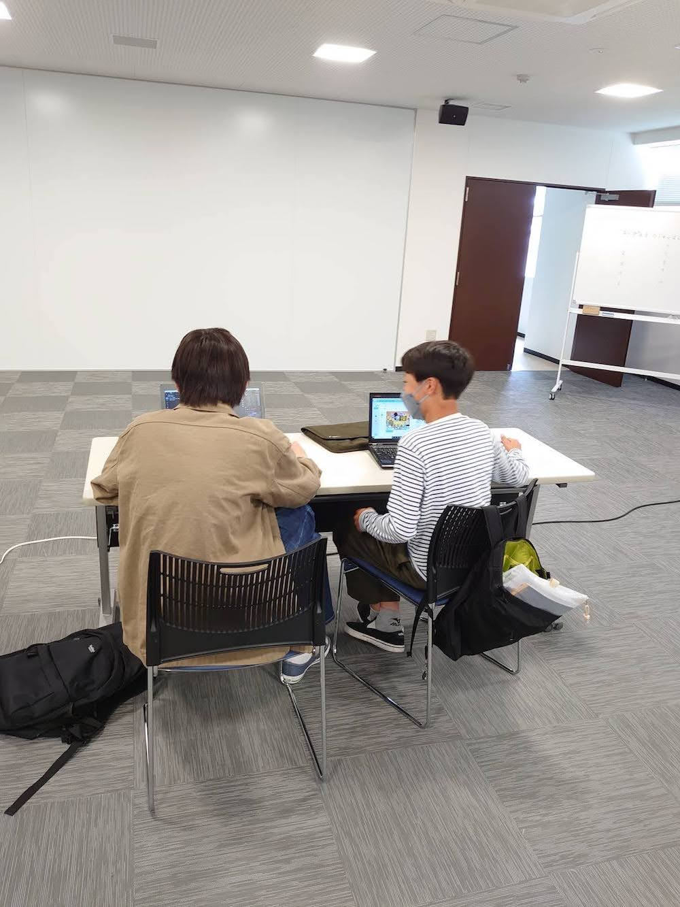

[子ども向けプログラミング道場：コーダー道場 55 回目 @大阪狭山](https://coderdojo-hommachi.doorkeeper.jp/events/136009)

`3`名の **メンター** と`4`名の **ニンジャ** が集まりました。

会場は「[UP っぷ（子育て支援・世代間交流センター）](http://www.city.osakasayama.osaka.jp/kosodate_kyoiku/kosodate/upp_kosodatesiensedaikankouryuusenta1/index.html)」にて開催させていただきました。

## 当日のスケジュール ⏰

| 時間                   | 内容                  |
| ---------------------- | --------------------- |
| 10:00 - 10:10 (10 min) | オープニング          |
| 10:10 - 11:00 (50 min) | プログラミング        |
| 11:00 - 11:10 (10 min) | 休憩                  |
| 11:20 - 12:00 (40 min) | プログラミング の続き |
| 12:00 - 12:25 (25 min) | 作品発表              |
| 12:25 - 12:30 (5 min)  | クロージング          |

## レポート 📝

### オープニング

換気をしていても暖かい季節です。中高生が試験前なのでいつもの少ない人数です。

メンターが きたみ りゅうじ さんの著書をいくつか持ってきてくれました。絵が可愛いと読みやすいです。

### プログラミング

プログラミングでポケモンをうごかしてみよう を体験しています。 ポケモンが好きなようです。

試験前なのでカバンには勉強道具が入っています。にゃんこが好きなようです。

### 電子工作島

前日の CoderDojo Camp に出展した一式を 電子工作島 に持ってきました。

ロブリック の体験は前日に続いて人気です。座らせたり立たせたりをするのが好きみたい。

ロボホン は歌や踊りが得意です。保護者の方が気になっていたようです。

### 作品紹介

メガネの柄(え)も光るエモいサングラスは micro:bit でプログラミングができます。

見ている方が笑顔になります。サングラスなので掛けている子供は眩しくありません。

### 作品発表

#### 発表１

CoderDojo Camp の紹介です。 本町のチャンピオンが作成してくれた動画は[こちら](https://www.youtube.com/watch?v=UC2SPwX96bo)です。

野外のイベントでしたが子供たちがいつも通りに楽しんでいます。ガーランドがあるとキャンプ感がありますね。

大人たちは準備が大変でしたが、いつもとは違う景色なのでたくさんの写真を撮りました。

#### 発表２

Blender でキャラクターのモデリングを始めています。

顔の正面は完成したようです。完成したら 3D プリンターで出力するのかな？

髪の毛を作成するデモをしてくれました。ねんどのように取り付けます。

### クロージング

電子工作を毎回楽しみにしてくれるので、次回も電子工作島を準備します。

