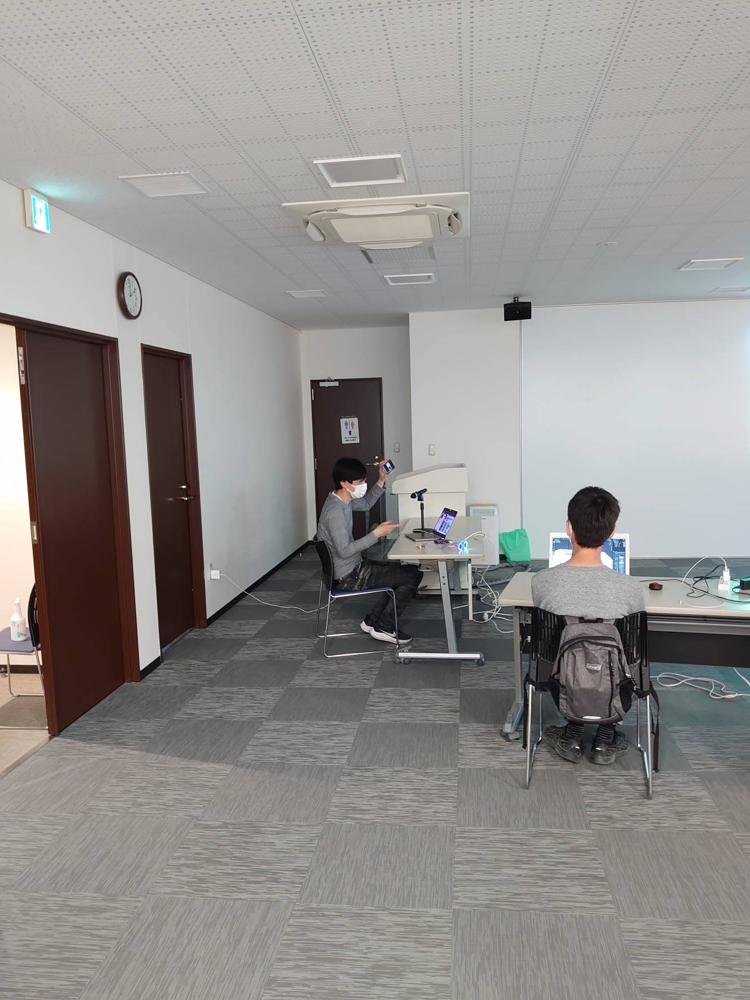

[子ども向けプログラミング道場：コーダー道場 56 回目 @大阪狭山](https://coderdojo-hommachi.doorkeeper.jp/events/137343)

`3`名の **メンター** と`6`名の **ニンジャ** が集まりました。

会場は「[UP っぷ（子育て支援・世代間交流センター）](http://www.city.osakasayama.osaka.jp/kosodate_kyoiku/kosodate/upp_kosodatesiensedaikankouryuusenta1/index.html)」にて開催させていただきました。

## 当日のスケジュール ⏰

| 時間                   | 内容                  |
| ---------------------- | --------------------- |
| 10:00 - 10:10 (10 min) | オープニング          |
| 10:10 - 11:00 (50 min) | プログラミング        |
| 11:00 - 11:10 (10 min) | 休憩                  |
| 11:20 - 12:00 (40 min) | プログラミング の続き |
| 12:00 - 12:25 (25 min) | 作品発表              |
| 12:25 - 12:30 (5 min)  | クロージング          |

## レポート 📝

### オープニング

すっかり初夏ですが、室内は空調があるので快適です。

風魔ステッカーはリアルの DojoCon に参加しないと手に入りません。（手持ちが少なくなってきました。）

### プログラミング

Blender の使い方を動画で調べています。

隣同士でも 1 つの机なので仲良くなっています。

隣同士で教え合うスタイルが定着しているようです。

### 電子工作島

お馴染みになりつつある電子工作島です。このために見学に来てくれた参加者もいます。

[Micro:bit は CoderDojo Japan](https://news.coderdojo.jp/2022/05/16/1500-microbits-to-coderdojo/) から届くので、それまで体験会をします。

ロボホン の体験会も人気です。（そろそろ子供の体験が終わったので、大人も体験ができそう）

### 作品紹介

ワイヤレス給電の天然石です。アイスブルーのカラーなので涼しげです。

### 作品発表

#### 発表１

Micro:bit のプログラミングの紹介です。A ボタンで色が変わって、B ボタンで明るさが変わります。

AB ボタンの同時押しで 40 個のネオピクセルがパピリな感じに点滅します。

Scratch と同じように関数が使えるので、コードがすっきりと書けます。

#### 発表２

Scratch のアクションゲームです。新作を作り始めたそうです。

首がたくさんのドラゴンが迫ってきて、ネコが逃げています。

首がたくさんのドラコンは、コスチュームで首を複製して作りました。

#### 発表３

Scratch のアニメーションです。魚が釣り針に吸い寄せられます。

標準の魚でも fish-a から fish-d まで４種類あるからので賑やかです。

水中の音を選んでいるので、釣られた時に音がなるようにしたいそうです。

### クロージング

会場からのお知らせです。コンテストでプレゼントしたメダルが人気だったので、それを作るイベントが開催されます。(参加費の材料代は、CoderDojo 大阪狭山に寄付されます。)

