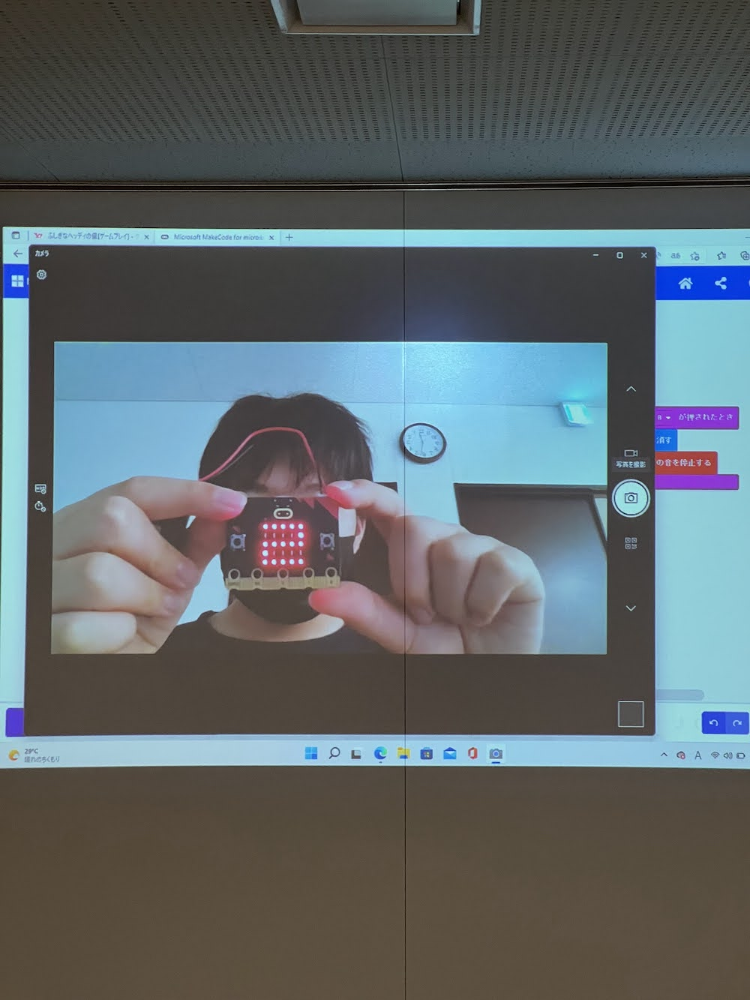
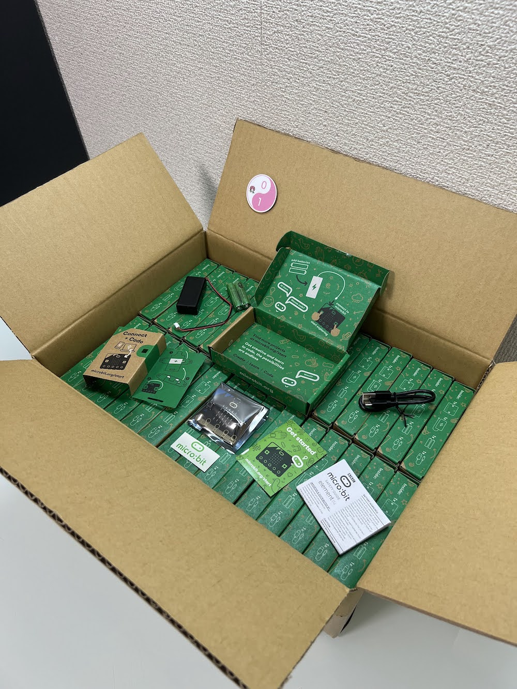

[子ども向けプログラミング道場：コーダー道場 57 回目 @大阪狭山](https://coderdojo-hommachi.doorkeeper.jp/events/139592)

`3`名の **メンター** と`6`名の **ニンジャ** が集まりました。

会場は「[UP っぷ（子育て支援・世代間交流センター）](http://www.city.osakasayama.osaka.jp/kosodate_kyoiku/kosodate/upp_kosodatesiensedaikankouryuusenta1/index.html)」にて開催させていただきました。

## 当日のスケジュール ⏰

| 時間                   | 内容                  |
| ---------------------- | --------------------- |
| 10:00 - 10:10 (10 min) | オープニング          |
| 10:10 - 11:00 (50 min) | プログラミング        |
| 11:00 - 11:10 (10 min) | 休憩                  |
| 11:20 - 12:00 (40 min) | プログラミング の続き |
| 12:00 - 12:25 (25 min) | 作品発表              |
| 12:25 - 12:30 (5 min)  | クロージング          |

## レポート 📝

### オープニング

いつもよりも少ない参加者ですが、参加者との交流は普段よりも多くできます。

### プログラミング

マイクロビットがたくさん届いたので、参加者の全員に提供することができます。

以前からマイクロビットを使っている参加者は、ネオピクセルのプログラミングをしています。

LED が思った通りに写真に撮れないので、シャッタースピードを調整したり工夫をしています。

micro:bit Go は箱の中の紙を切り離すと電池ボックスのベルトになります。

### 電子工作島

それぞれの机で micro:bit をしているので、この島は展示スペースになっています。

たのしい micro:bit コンテストの受付が 7 月 19 日 で締切なので今回は間に合わなそう。

### 作品紹介

ワイヤレス給電で苔テラリュウムの天然石が光っています。（ガーデンマスコットもモデリングをして作りました。)

パリピなメガネはコンテストのヒントになるかな

### 作品発表

#### 発表１

micro:bit で簡易な四則演算の計算機です。

A ボタンで一つ目の数字を表示、B ボタンで四則演算の記号を表示します。

ボタンの数が少なくて困りましたが、メンターから音や加速度センサーも使えるとアドバイスがありました。

3D モデリングで製作しているアイテムの紹介です。

光る部分があるそうなので micro:bit が使えそうです。

#### 発表２

Scratch の ブロック崩しです。

ブロックに当たると得点が入ります。（作者なのでノーミスでクリアしていました。）

ブロックに当たった時の音やゲーム終了の音選びのセンスがよいです。

プログラミングのコメントを記載しています。 玉の色は自由に変えることができます。

#### 発表３

micro:bit の 10 秒タイマーです。

PC のカメラを使って発表してくれました。

数字のカウントダウンを 600 ミリ秒で停止してます。

ゼロになると音がなります。（スマフォのストップウォッチで計測しました。）

### クロージング

箱にぎっしりのマイクロビットが届きました。たくさんあるので地域の CoderDojo でもコンテストの開催を検討します。
micro:bit 寄贈プログラムの関係者の皆様、ありがとうございます。

