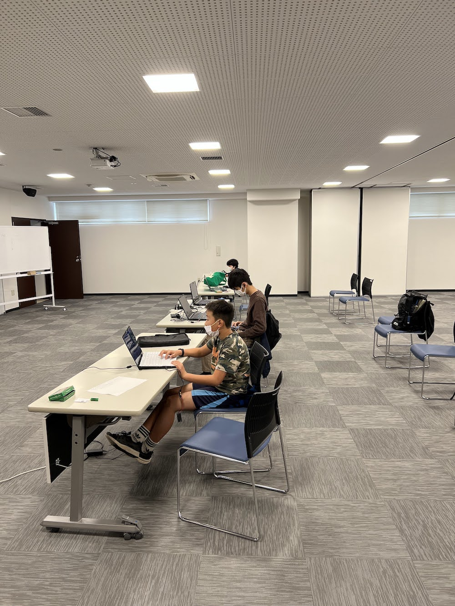
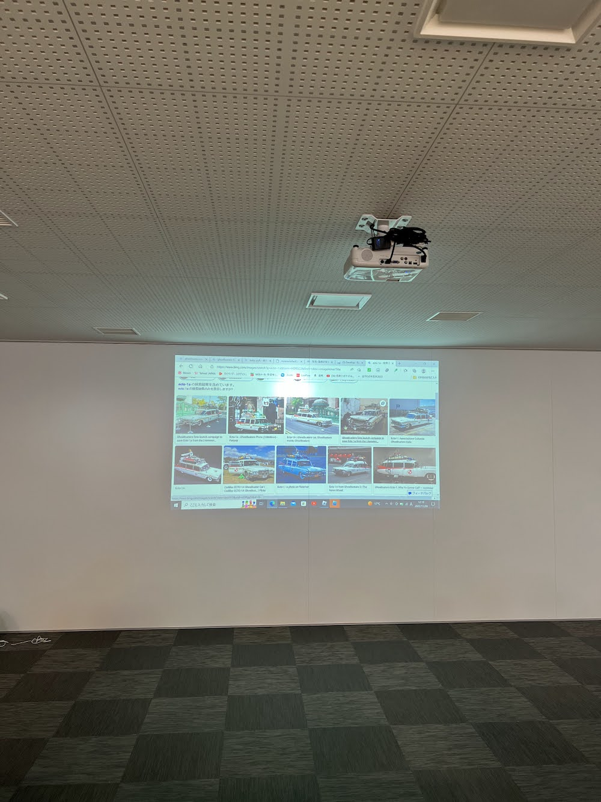

[子ども向けプログラミング道場：コーダー道場 61 回目 @大阪狭山](https://coderdojo-osakasayama.doorkeeper.jp/events/146042)

`3`名の **メンター** と`5`名の **ニンジャ** が集まりました。

会場は「[UP っぷ（子育て支援・世代間交流センター）](http://www.city.osakasayama.osaka.jp/kosodate_kyoiku/kosodate/upp_kosodatesiensedaikankouryuusenta1/index.html)」にて開催させていただきました。

## 当日のスケジュール ⏰

| 時間                   | 内容                  |
| ---------------------- | --------------------- |
| 10:00 - 10:10 (10 min) | オープニング          |
| 10:10 - 11:20 (70 min) | プログラミング & 図工 |
| 11:20 - 11:30 (10 min) | 休憩                  |
| 11:30 - 12:00 (30 min) | プログラミング の続き |
| 12:00 - 12:20 (20 min) | 作品発表              |
| 12:20 - 12:30 (10 min) | クロージング          |

## レポート 📝

### オープニング

micro:bit がテーブルにあるのが自然な光景になっています。

チャンピオン の PC は CoderDojo 大阪狭山 のロゴステッカーが貼っています。

### プログラミング

micro:bit の接続方法です。メンターからのアドバイスでブラッシュアップしています。（書いたら覚えたそうです）

ゴーストバスターズの車です。映画は見たことがないそうです。

Blender でモデリングをして、テクスチャーを貼っています。

### 工作島

[テオ・ヤンセン](https://www.mbs.jp/theojansen-osaka/) のミニビーストをみんなで作ります。

組み上がったけど、一部に誤りがあるようです。一度では成功しないのはプログラミングも同じです。
少し ふりかえり をして、どうしたらよかったを話し合いました。（いつか再チャレンジします）

### 作品紹介

コンテストでプレゼントをするメダルです。ロゴは 4 年ぶりの作成なので文字がアップデートされています。

UV レジンプリンンターだとキャラクターが入った作品ができますね。

### 作品発表

#### 発表１

Scratch のレトロなゲームです。インベーダーゲームはやったことはないそうです。

お母さんから聞きながら作っているので、元の仕様が分からないから ユーホー が真ん中にいます。

スプライトは自作です。弾が当たるとインベーダーが消えるのは未実装です。

#### 発表２

micro:bit の 10 秒タイマー です。音をブラッシュアップしました。

micro:bit は PC のエミュレーターより、本体の方が良い音が鳴っています。

LED は点滅しているので写真を撮るのが難しいです。（たぶん数字の４）

#### 発表３

Roblox で街を作っています。キャデラックが好きで映画を知ったそうです。

車もキャラクターはネットで調べてモデリングをしています。（完成度が高いです。）

今回は 80 年代に流行った作品が多いけど、親世代でも知っている人は少ないです。

### クロージング

12 月は発表大会です。広く参加できるように 3 つの部門にします。

- プログラミング
  - Scratch や Roblox など
- モデリング
  - Blender や Fusion 360 など （ibisPaint もこちら）
- 電子工作
  - micro:bit や Raspberry Pi など

[前回の発表大会](https://coderdojo-hommachi.github.io/blog/2021-12-19-report1/)です。（今回も大人でもエントリーできます。）
