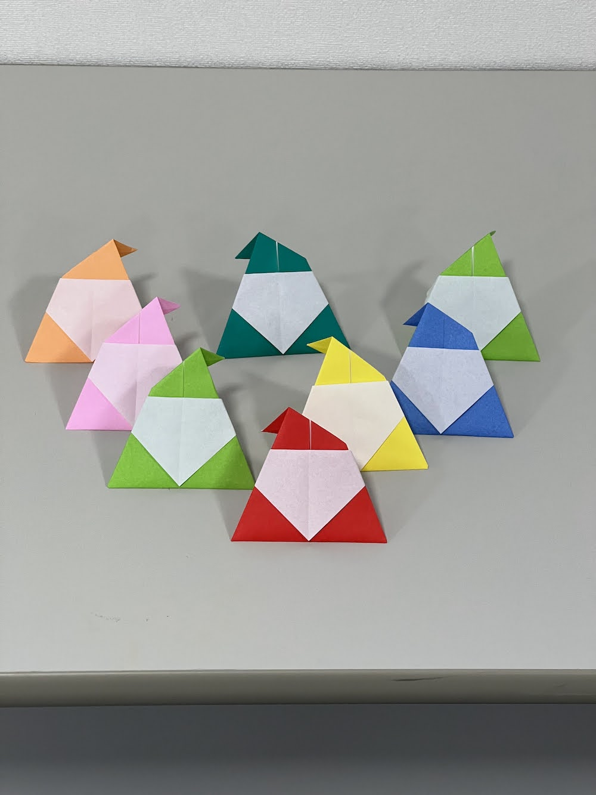
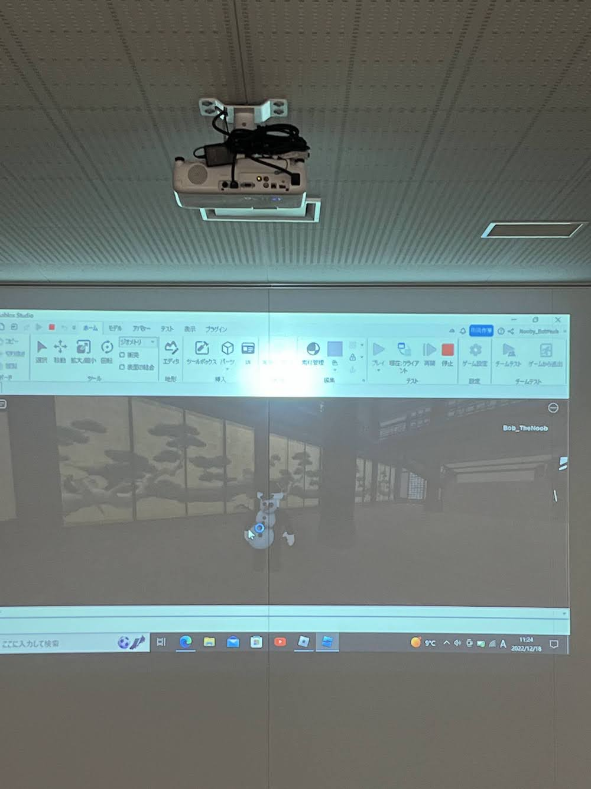
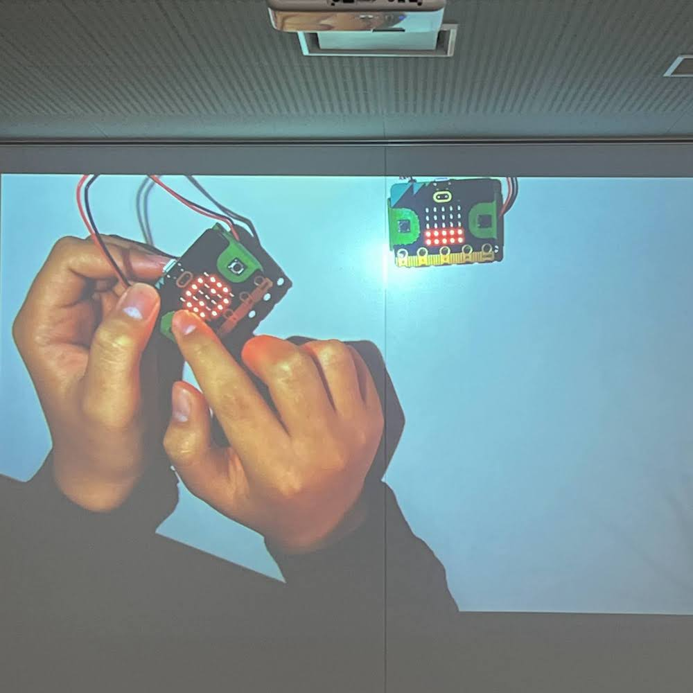

[子ども向けプログラミング道場：コーダー道場 62 回目 @大阪狭山](https://coderdojo-osakasayama.doorkeeper.jp/events/147631)

`3`名の **メンター** と`5`名の **ニンジャ** が集まりました。

会場は「[UP っぷ（子育て支援・世代間交流センター）](http://www.city.osakasayama.osaka.jp/kosodate_kyoiku/kosodate/upp_kosodatesiensedaikankouryuusenta1/index.html)」にて開催させていただきました。

## 当日のスケジュール ⏰

| 時間                   | 内容                      |
| ---------------------- | ------------------------- |
| 10:00 - 10:10 (10 min) | オープニング              |
| 10:10 - 11:00 (50 min) | 発表準備                  |
| 11:00 - 11:50 (50 min) | 発表大会                  |
| 11:50 - 12:00 (10 min) | コンテスト受賞            |
| 12:00 - 12:10 (10 min) | プレゼント大会            |
| 12:10 - 12:15 (5 min)  | クロージング & 交流タイム |

### オープニング

今年はコンテストの部門を 3 つに増やして発表大会を開催します。

クリスマスが近いのでツリーが会場に飾っています。

プレゼントの準備もできています。

### プレゼント

メンター や ニンジャ が会場で折ってくれた サンタ。

保護者からの クリスマス の お菓子。

[ポノス様](https://www.ponos.jp/) からの [にゃんこ大戦争](https://battlecats.club/) の パーカー。

メンター手作りの [さやりん](http://www.mydoo.net/sayarin/) の ペンダントトップ。

コンテストの副賞の micro:bit と CoderDojo の メダル。

### 発表大会

#### 発表１

メンターの [Bit Arrow](https://bitarrow.eplang.jp/) の紹介です。

Web ブラウザでプログラミング言語が実行できるので便利です。

Python の環境で変数の値を表示するデモです。

高校の情報の授業は [Python 入門](https://ten.tokyo-shoseki.co.jp/text/hs/joho/h-kyozai/) を副教材で使っています。

#### 発表２

[Roblox](https://www.roblox.com/) でメタバースの東京の街を作っています。

まずは街をドライブする車を３台からオーディエンスに選んでもらいます。

コースターに乗って街を紹介します。レールは自分で組み立てました。

コースターには飛び乗ります。

空の景色が綺麗です。

スカイツリーや東京タワー、東京総合病院や城など様々な建築が再現されています。

お城の中もきちんと作り込まれています。

十字路の信号機は赤と青が入れ替わるようにプログラミングされています。

#### 発表３

[Procreate](https://procreate.com/jp) でイラストを描いています。

ポケモンのニャローテです。

水彩ブラシやエアーブラシなど編の種類が多いのがよいです。

レイヤーやカットなど便利な機能もたくさんあります。

#### 発表４

Fusion 360 で映画に登場するアイテムを作っています。

首輪爆弾模型 は名探偵コナンに登場するアイテムを再現しています。

3D プリンターで実際に印刷しています。

稼働するところはジョイントのアセンブリを使っています。

透明なパーツは アクリル か UV レジン が利用できそうです。

液体を実際に封じ込めて、よりリアルに再現するそうです。

#### 発表５

micro:bit のタイマーです。10 秒と 3 分の 2 つがあります。

まずは発表時間の 3 分タイマーをセットします。下から順に赤く光ります。

10 秒 タイマー は全点灯の機能を追加して、懐中電灯で使えるようにしました。

端子 と グランド端子 を指で触るとスイッチになるのは面白いです。

#### 発表６

micro:bit で色々な音を作っています。

micro:bit を振ると音が鳴ります。

色々な音が鳴るようにエディターで編集をしています。

端子を使った拡張機能も試してみたいです。

### コンテスト

それぞれ時間をかけた作品なので、いろいろなコンテストに挑戦するとよさそうです。

副賞の micro:bit と CoderDojo のメダルを手渡しています。

プログラミング 部門 おめでとう！

モデリング 部門 おめでとう！

電子工作 部門 おめでとう！

### プレゼント大会

プレゼントはスピードくじ方式で子供たちが選びます。

[にゃんこ大戦争](https://battlecats.club/) の パーカーは全員分あります。[ポノス様](https://www.ponos.jp/) ご支援ありがとうございます。

パーカーを早速着てくれて、気に入ってくれているようです。

### クロージング

来年の干支が卯なので、招きうさぎ のマスコットを展示しています。

会場からの告知です。プレゼントにあった さやりん のグッズが作れます。

