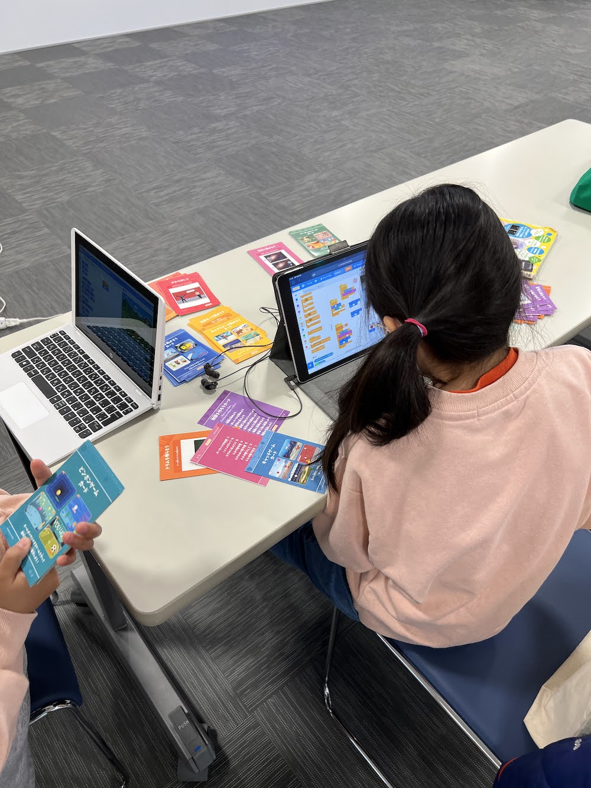

[子ども向けプログラミング道場：コーダー道場 64 回目 @大阪狭山](https://coderdojo-osakasayama.doorkeeper.jp/events/150112)

`4`名の **メンター** と`7`名の **ニンジャ** が集まりました。

会場は「[UP っぷ（子育て支援・世代間交流センター）](http://www.city.osakasayama.osaka.jp/kosodate_kyoiku/kosodate/upp_kosodatesiensedaikankouryuusenta1/index.html)」にて開催させていただきました。

## 当日のスケジュール ⏰

| 時間                   | 内容                  |
| ---------------------- | --------------------- |
| 10:00 - 10:10 (10 min) | オープニング          |
| 10:10 - 11:20 (70 min) | プログラミング        |
| 11:20 - 11:30 (10 min) | 休憩                  |
| 11:30 - 12:00 (30 min) | プログラミング の続き |
| 12:00 - 12:20 (20 min) | 発表                  |
| 12:20 - 12:30 (10 min) | クロージング          |

## レポート 📝

### オープニング

わくフェスからの初参加の方が 2 組です。（マスクは任意になりましたが、みんなマスクを着用しています。）

[CoderDojo へようこそ](https://coderdojo.jp/) のスライドは定期的にオープニングで説明しています。

### わくフェス

2 月は街のイベントの [わくフェス](https://osayama.com/event/56542) に CoderDojo 道場で参加していました。

ロボホンの [ロブリック](https://robohon.com/apps/robrick.php) の体験と、街のゆるキャラの _さやりんを歩かせよう_ の Scratch の体験で出展しています。

さやりんのぶどう集め で集めた数で景品がもらえるゲームで、さやりんメダルをプレゼントしました。

### プログラミング

[Scratch カード](https://resources.scratch.mit.edu/www/cards/ja/scratch-cards-all.pdf) でプログラミングをしています。（姉妹で楽しんでいます。）

_プログラミングでポケモンをうごかしてみよう_ を体験しています。（イーブイが使えて喜んでいました。女の子たちに人気があります。）

高校生のユースメンターが初参加の子をサポートしています。

全員が発表がなくてもプログラミング中の画面を見に行って、何をしているか教えてもらって賑やかです。

### 工作島

会場はまだ飲食ができないので、福岡県の限定のガンプラのお土産です。

モブプロで次回から作り始める予定です。（説明書を読む人、パーツを外す人、パーツを組む人の複数人で参加できます。）

### 作品紹介

Unity で森で焚き火ができる世界を作っています。（図書館で本を借りてきたそうです。新刊がすぐにでるので図書館が充実してると嬉しいです。）

Scratch のテニスのゲームです。2 人プレイのようです。

Lua と DirectX で車のクラッシュのシュミレータです。コンパネが Cool です。

クラッシュ は再生ができるそうです。車の車種はたくさんありました。

### 発表

#### 発表１

Blender の人物のモデリングです。髪の毛の作り方を実演です。

カーブをつけたり、頂点を膨らませたり、先を細くする方法です。

コピーとペーストで髪の毛を増やして、調整を繰り返します。

#### 発表２

[Maker Faire Kyoto 2023](https://makezine.jp/event/mfk2023/) の紹介です。4 月 29 日と 4 月 30 日に開催されます。

[子どもプログラミング喫茶](https://pgmsaloon4kids.github.io/) が 4 年ぶりにリアルで開催されます。一緒に活動してくださる方を募集中です。

[スポンサー](https://makezine.jp/event/mfk2023/sponsors/#BouqueTecCorporation)からチケットの寄付がありそうです。（次回の開催で枚数限定で配れます。）

### クロージング

多少の密は大丈夫そうなので、次回から机の配置を従来の形に戻そうと思います。

