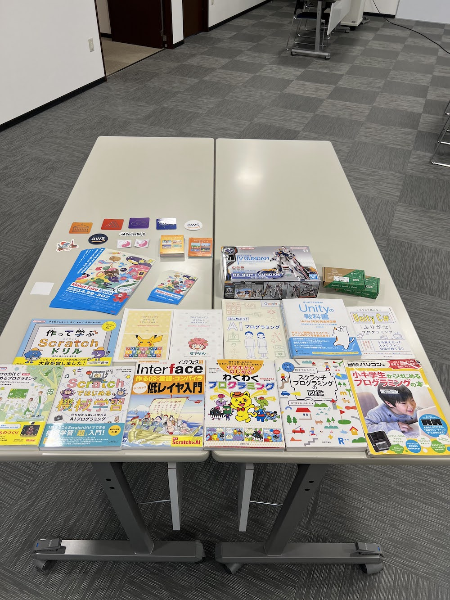

[子ども向けプログラミング道場：コーダー道場 64 回目 @大阪狭山](https://coderdojo-osakasayama.doorkeeper.jp/events/154232)

`4`名の **メンター** と`7`名の **ニンジャ** が集まりました。

会場は「[UP っぷ（子育て支援・世代間交流センター）](http://www.city.osakasayama.osaka.jp/kosodate_kyoiku/kosodate/upp_kosodatesiensedaikankouryuusenta1/index.html)」にて開催させていただきました。

## 当日のスケジュール ⏰

| 時間                   | 内容                  |
| ---------------------- | --------------------- |
| 9:30 - 9:40 (10 min)   | オープニング          |
| 9:40 - 10:50 (70 min)  | プログラミング        |
| 10:50 - 11:00 (10 min) | 休憩                  |
| 11:00 - 11:30 (30 min) | プログラミング の続き |
| 11:30 - 11:50 (20 min) | 発表                  |
| 11:50 - 12:00 (10 min) | クロージング          |

## レポート 📝

### オープニング

開始時間を `9時30分` に変更して、終了時間が `12時` に終ります。(お昼前に終われる方がよさそうです。)

机の配置を対面の島形式に戻しました。（こちらの方が友達になりやすそうです。）

[メイカーフェア京都 2023](https://makezine.jp/event/mfk2023/)の招待状を子供達に渡します。（１枚で `2名` まで入場できます。）

メイカーフェア京都は子供達にも楽しい場所になりそうです。[子どもプログラミング喫茶 京都店](https://pgmsaloon4kids.github.io/kyoto/) があります。

参加のきっかけになった [Interface 2021 年 2 月号](https://interface.cqpub.co.jp/magazine/202102/) を持ってきて頂きました。（全国の CoderDojo 掲載されています。）

### プログラミング

島形式だと距離が近くなって、仲良くなって話しやすそうです。

Blender でモデリングをしています。

iPad に Apple Pencil で絵を描いています。

Minecraft カップ に興味があるそうです。

### Minecraft カップ

この日は `11時` から [Minecraft カップ](https://minecraftcup.com/) の[オープニングイベント](https://www.youtube.com/watch?v=WbVrlx_LZ2g)が開催されるのでみんなで観ます。

[教育版マインクラフトのライセンス貸出](https://news.coderdojo.jp/2022/05/31/partnership-with-minecraftcup/) は CoderDojo 大阪狭山から申請をしています。

### 工作島

電子工作のメンターが準備をしてくれています。

ガンプラを作る準備もできています。

パーツはランナーを切ってから、ゲートを切ると綺麗に処理できます。

頭まで完成です。（ツノは危ないかもしれないので最後に付けます。）

### 作品紹介

### 発表

#### 発表１

Scratch のアニメーションです。カエルのコスチュームを組み合わせています。

虫を食べている動きをリアルにしています。端に付いたら跳ね返ります。

#### 発表２

CyanogenMod (サイアノジェンモッド) を使って 旧式の Android で Wi-Fi を使えるようしたいそうです。

機種も旧式なので [GitHub](https://github.com/CyanogenMod) のリポジトリをフォークして対応しているようです。

#### 発表３

Scratch のアクションゲームです。初めて Scratch カードを使ってピンポンゲームを作ることができています。

ピンポンゲームは Scratch カードで一番の人気です。

#### 発表４

メンターの電子工作です。PS4 のコントローラー、超音波センサー、3D プリンラーでケースも作っています。

画面に表示された文字を読み上げます。（機会音声が Cool です。）

#### 発表５

メンターからの告知です。 [DojoCon Japan 2023](https://dojocon2023.coderdojo.jp/) が開催されます。

開催日は `8月27日` 開催場所は `奈良県` テーマは `"Be Cool"` です。

### クロージング

DojoCon Japan や メイカーフェア が開催されるほど通常に戻ってよかったです。（みなさんと京都や奈良で会いましょう。）

