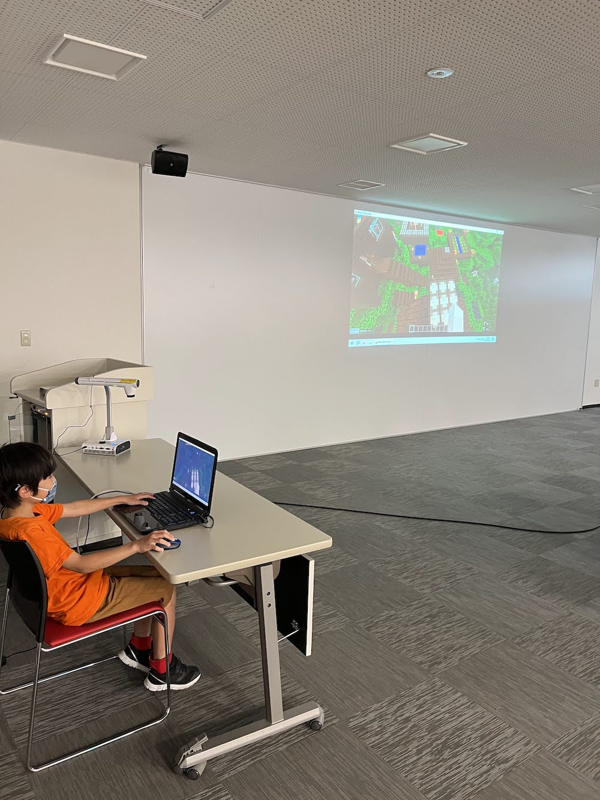
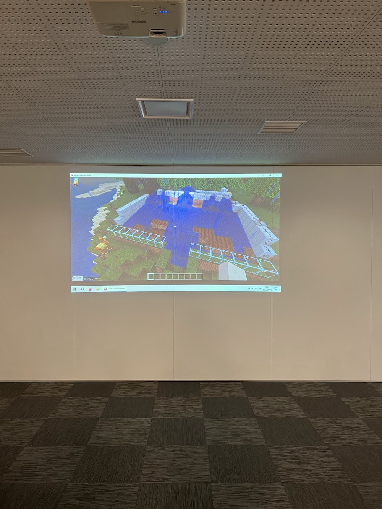

[子ども向けプログラミング道場：コーダー道場 66 回目 @大阪狭山](https://coderdojo-osakasayama.doorkeeper.jp/events/156340)

`3`名の **メンター** と`9`名の **ニンジャ** が集まりました。

会場は「[UP っぷ(子育て支援・世代間交流センター)](http://www.city.osakasayama.osaka.jp/kosodate_kyoiku/kosodate/upp_kosodatesiensedaikankouryuusenta1/index.html)」にて開催させていただきました。

## 当日のスケジュール ⏰

| 時間                   | 内容                  |
| ---------------------- | --------------------- |
| 9:30 - 9:40 (10 min)   | オープニング          |
| 9:40 - 10:50 (70 min)  | プログラミング        |
| 10:50 - 11:00 (10 min) | 休憩                  |
| 11:00 - 11:30 (30 min) | プログラミング の続き |
| 11:30 - 11:50 (20 min) | 発表                  |
| 11:50 - 12:00 (10 min) | クロージング          |

## レポート 📝

### オープニング

机はこの島スタイルの方が、それぞれにワイワイの感じがでてよいです。

参加者が増えてきたので、共感することが得意な保護者の方が共感の専任のメンターとして参加してくれます。

新刊の [ユウと魔法のプログラミング・ノート](https://www.oreilly.co.jp/books/9784814400294/) と [はじめてつくる Web アプリケーション](https://gihyo.jp/book/2023/978-4-297-13468-6) です。

### プログラミング

[Scratch アクティビティ カードブック](https://www.dx-publishing.jp/ja/products/scratch-activity-card-book/) を持ってきてくれました。(この道場で使っているカードはメンターの手作りです。)

女子の参加者が多くなっています。(こうして交流ができるようになってよかったです。)

### 作品紹介

光るネコフェイスです。(この会場でワークショップをすることが決まりました。)

ハニワのネコミミが光って盛り上がっています。(後ろには、たくさんのギャラリーがいます。)

### 発表

#### 発表１

CyanogenMod (サイアノジェンモッド) を使って 旧式の Android で Wi-Fi を使えるようにしています。

前回の発表の機種よりも新しい機種を使っています。

Android のバージョンを 8 から 11 に上げることに成功しています。

#### 発表２

M5Stack でハニワのネコミミが光ります。(ミニサイズのネオピクセルはアクセサリーに使いやすそうです。)

タッチ操作で色を変更できます。(このハニワは小学生のときに作ったものだそうです。)

M5Stack には Node-RED を使って JavaScript でプログラミングをしています。

#### 発表３

[Minecraft カップ](https://minecraftcup.com/) にエントリーする作品の紹介です。

テーマからコンセプトを決めて進めているそうです。(SDGs 目標 5、7、11 の 3 つのテーマから 1 つ以上を選びます。)

エントリーの締切は 8 月末まであるので、この道場の他の子供達も参加できそうです。

#### 発表４

Scratch カードのピンポンのゲームです。(親子で発表するスタイルもありです。)

ボールが小さすぎて分かり難いですが、ピンポンのゲームになっています。

最初はボールが跳ねてただけで楽しいです。("最初はネコが歩いてただけで楽しかった！"を思い出します。)

#### 発表５

Scratch カードのキャラクターを動かそうです。(このカードを作った時よりも新しくなっています。)

チョウチョやアリは手書きで追加しています。(普段からアプリで絵を描いているそうです。)

ネコがジャンプした残像やチョウチョが挨拶するアニメーションができています。(表現したいことに共感できると嬉しい。)

### クロージング

電子工作のメンターは 6 月の [テックシーカー ハッカソン](https://techseeker.jp/)に応募しているそうなの活躍が楽しみです。

