[子ども向けプログラミング道場：コーダー道場 66 回目 @大阪狭山](https://coderdojo-osakasayama.doorkeeper.jp/events/157335)

`3`名の **メンター** と`9`名の **ニンジャ** が集まりました。

会場は「[UP っぷ(子育て支援・世代間交流センター)](http://www.city.osakasayama.osaka.jp/kosodate_kyoiku/kosodate/upp_kosodatesiensedaikankouryuusenta1/index.html)」にて開催させていただきました。

## 当日のスケジュール ⏰

| 時間                   | 内容                  |
| ---------------------- | --------------------- |
| 9:30 - 9:40 (10 min)   | オープニング          |
| 9:40 - 10:50 (70 min)  | プログラミング        |
| 10:50 - 11:00 (10 min) | 休憩                  |
| 11:00 - 11:30 (30 min) | プログラミング の続き |
| 11:30 - 11:50 (20 min) | 発表                  |
| 11:50 - 12:00 (10 min) | クロージング          |

## レポート 📝

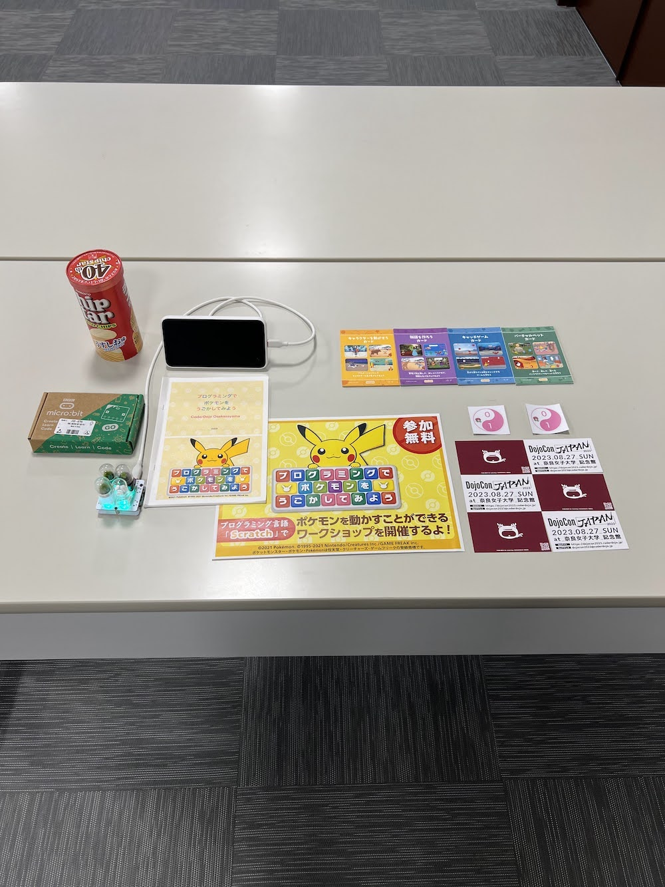

### オープニング

机の並びを島にしていますが、まだまだ距離をとっている感じです。

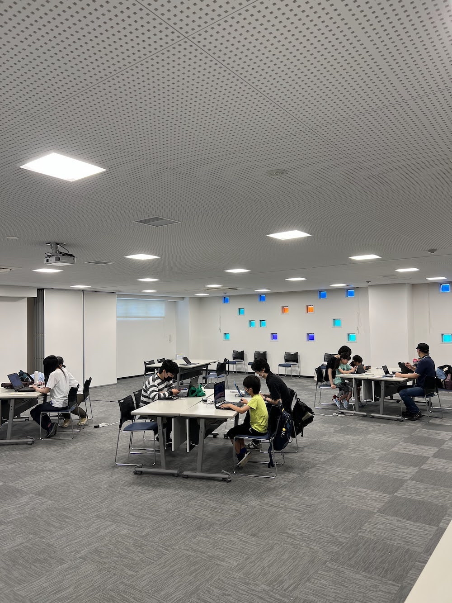

### プログラミング

**プログラミングでポケモンをうごかしてみよう** のワークショップをしています。

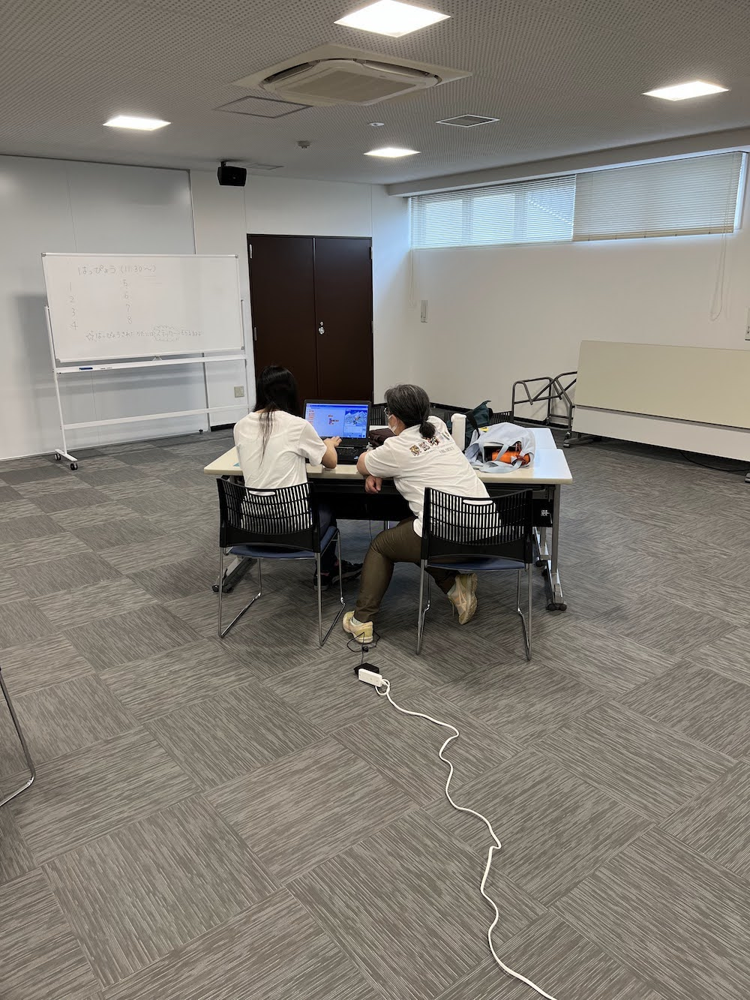

マイクラカップの紹介をしてから、マイクラをする参加者が増えています。（エントリーするのかな？）

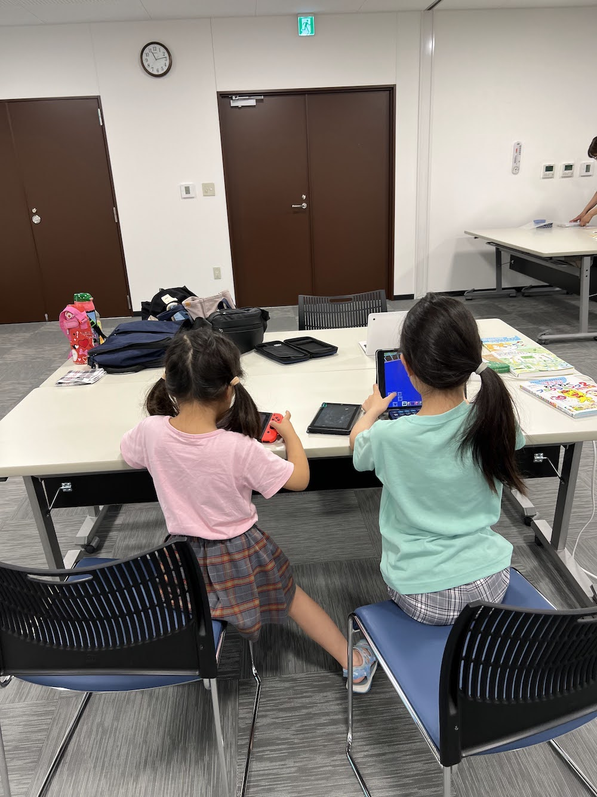

### 作品紹介

電子工作の自作キーボードです。PicoRuby というプログラミング言語で動いています。（キーキャップは苔テラリウム）

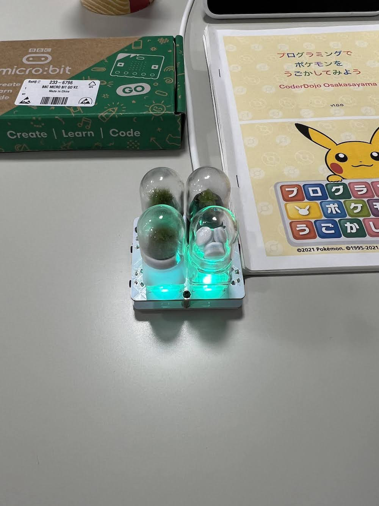

### 発表

#### 発表１

Scratch の **プログラミングでポケモンをうごかしてみよう** でアレンジをしています。

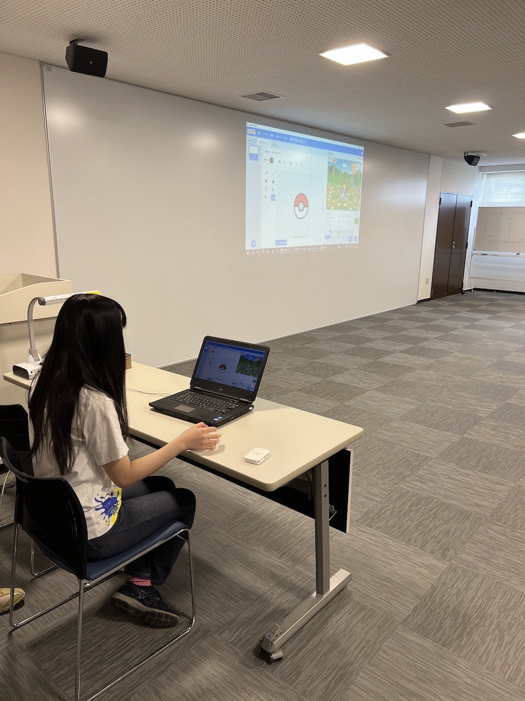

いろいろなポケモンが登場して、次々とゲットされています。

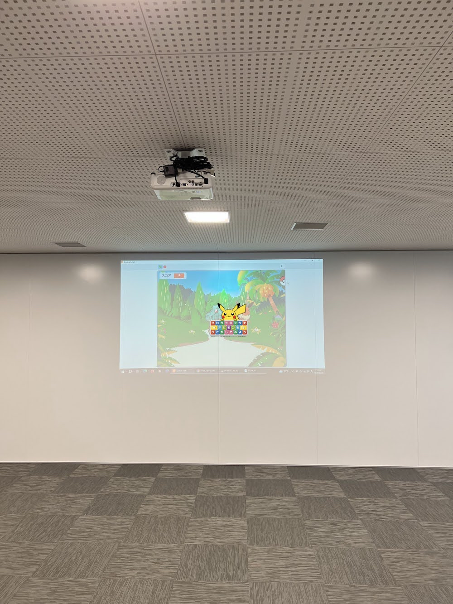

`50匹` ゲットしたら、メッセージが表示されます。(次回も **プログラミングでポケモンをうごかしてみよう** をやります。)

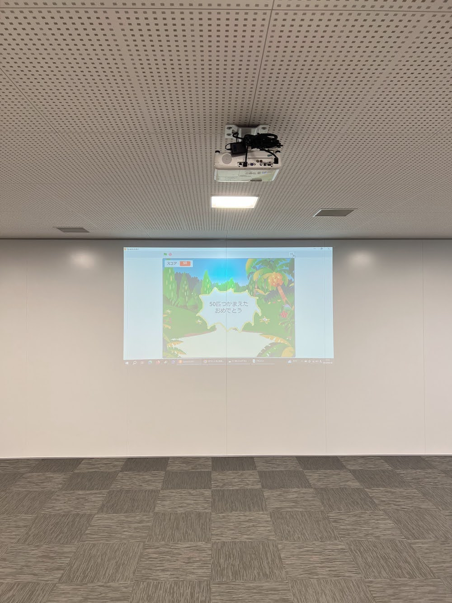

### クロージング

[Minecraft カップ](https://minecraftcup.com/application/)は `8月31日` が応募の締め切りなので、夏休みを十分に楽しもう！

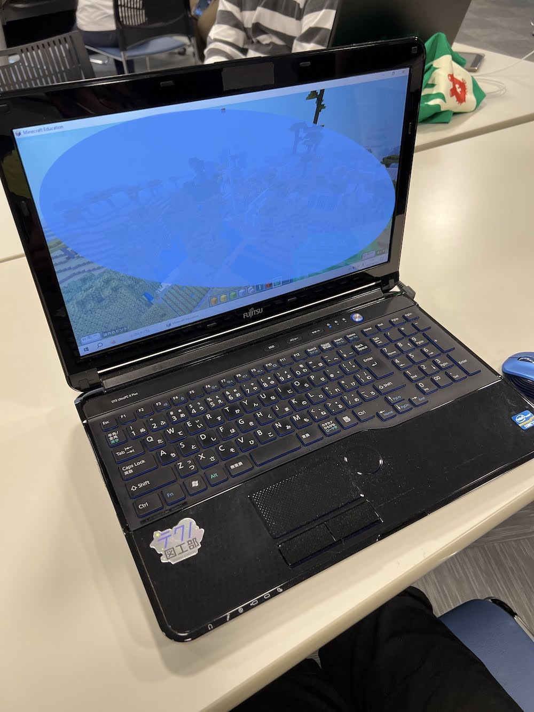

## テクノ図工部

[Techseeker Collection 2023（テックシーカー コレクション）](https://techseeker.jp/booth/booth-843/) のテクノ図工部の様子です。

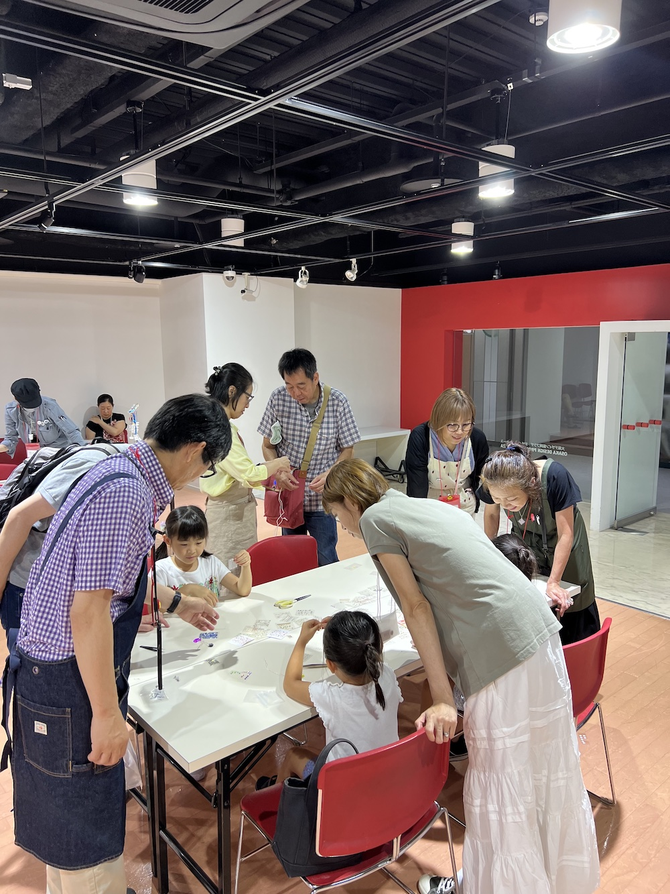

レジンで作った猫にネイルシールで好きな顔を作ります。電池で猫の顔が光ります。

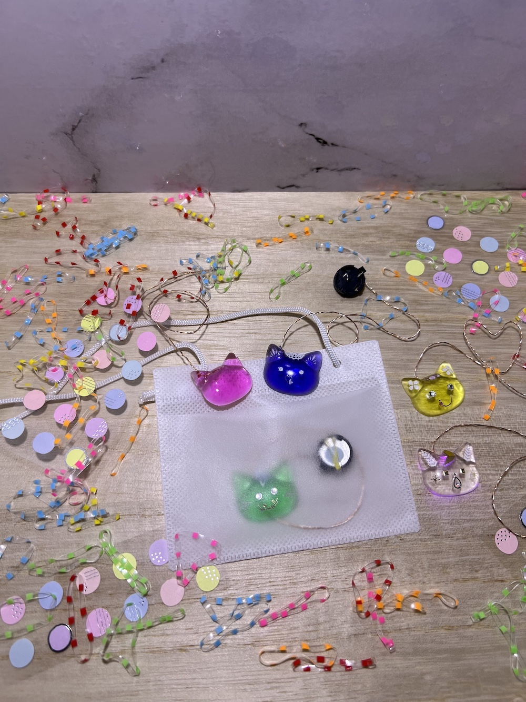

たくさんのシールがあるから子供達も大人も個性的な作品ができています。

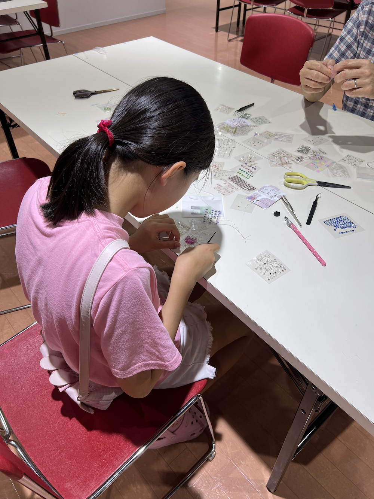

光るネコフェイスのイベントは、この会場で`11月18日`に開催が予定されています。

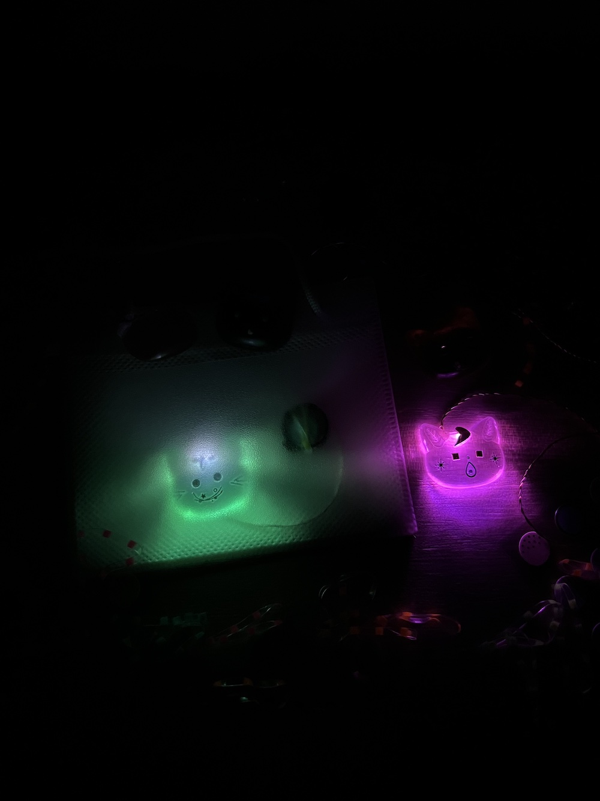
