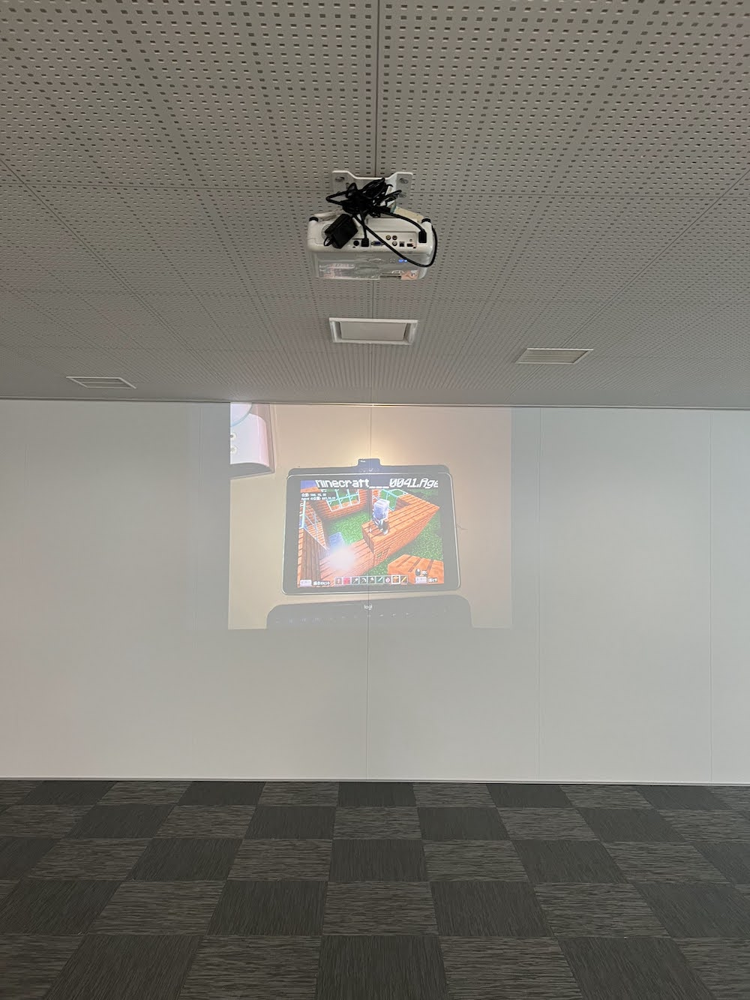

[子ども向けプログラミング道場：コーダー道場 71 回目 @大阪狭山](https://coderdojo-osakasayama.doorkeeper.jp/events/166790)

`2`名の **メンター** と`6`名の **ニンジャ** が集まりました。

会場は「[UP っぷ(子育て支援・世代間交流センター)](http://www.city.osakasayama.osaka.jp/kosodate_kyoiku/kosodate/upp_kosodatesiensedaikankouryuusenta1/index.html)」にて開催させていただきました。

## 当日のスケジュール ⏰

| 時間                   | 内容           |
| ---------------------- | -------------- |
| 9:30 - 9:40 (10 min)   | オープニング   |
| 9:40 - 10:30 (50 min)  | 発表大会の準備 |
| 10:30 - 11:20 (50 min) | 発表大会       |
| 11:20 - 11:40 (20 min) | プレゼント大会 |
| 11:40 - 11:50 (10 min) | 交流会         |
| 11:50 - 12:00 (10 min) | クロージング   |

## レポート 📝

### オープニング

12 月は館内にクリスマスの飾りがあちこちにあります。楽しそうでよいですね。

イルミネーションにニキシー管の時計が展示されています。

メンターが今年に読んだ本を持ってきてくれました。ChatGPT と GA4 は話題になりましたね。

[学生のファブリケーションフェス](https://thedeck.jp/event/fabfes2024)があるそうです。狭山は３ D モデリングをする子供が多いです。

### 発表大会の準備

年に一度の発表大会です。みんなはお家で準備しています。

博覧会の形式で展示でもありでしたが、みんな発表をしてくれました。

### 発表大会

#### 発表１

Blender の３ D モデリングです。印刷してファブリケーションフェスに出展するそうです。

人間のモデルで髪の毛から全身まで完成しています。

着色もされているとリアルな感じです。

#### 発表２

Minecraft のチートプログラミングの紹介です。親子発表の形式です。

爆破のエフェクトをいつでも発動することができます。

ライフがたくさんあって、高いところから落ちても平気だそうです。

#### 発表３

Minecraft で色々な船を作っています。ネットで戦艦を検索して調べながら構築しています。

空母はかなりの大きさがあります。飛行機もたくさん艦載できるようなので大変そう。

潜水艦が沈んでいたり、島から魚雷が発射できたり防衛もできています。

#### 発表４

Minecraft のスクリプトで自動でうちを作っています。姉妹で親子発表の形式です。

スクリプトでうまくいかない所は手動でフォローして共同作業をしています。

プログラミングで自動で構築されるのは便利ですね。

#### 発表５

Scratch のアクションゲームです。爆弾に当たらずにフルーツをゲットしていきます。

爆弾にあたるとゲームオーバーで、指定のフルーツをゲットするとクリアできます。

爆弾はだんだん増えていくので、フルーツを採りにいくのが大変です。

#### 発表６

micro:bit の音楽のオーケストラです。保護者の方も発表してくれます。

micro:bit はビープ音で音を鳴らすことができます。音は単音しか鳴りません。

通信ができるので、演奏の開始を合わせることで複数の音を鳴らすことができます。

#### 発表７

メンバーの電子工作の発表です。アウトドアでお湯を温め続ける検証です。

3D プリンタで外装を出力して、RGBLED は PickRuby で制御されています。

[Qiita](https://qiita.com/ogomr/items/542c49bf488d5f1852ba) といサイトで記事が公開されています。

#### 発表８

３ D モデリングでスマフォのケースを作っています。

Android の古い機種はケースがなかったりするので、自分で作れるのはよいですね。

WiFi が利用できない OS をバージョンアップさせて、認識するところまで進んだそうです。

### プレゼント大会

保護者の方からたくさんのプレゼントの寄付が集まりました。ありがとうございます。

まだ館内では食べることができないので、お家に帰って食べてね。

メンターが CoderDojo のロゴのアクキーを作ってきてくれました。

### クロージング

UP っぷの館が完成したときに CoderDojo 大阪狭山がスタートしたので、同じく５周年をむかえます。

楽しい冬休みを過ごせるように願っています。Happy Holidays!

