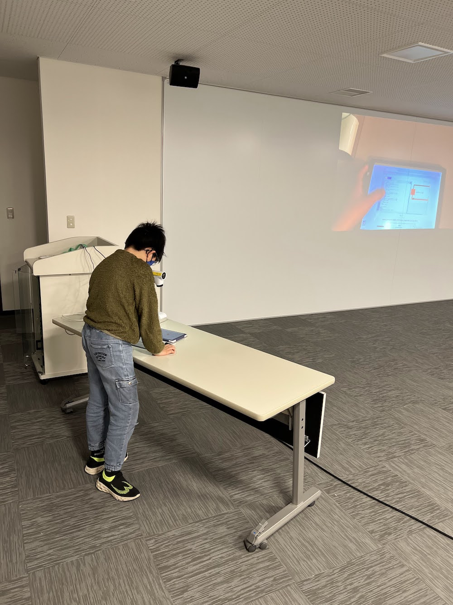

[子ども向けプログラミング道場：コーダー道場 72 回目 @大阪狭山](https://coderdojo-osakasayama.doorkeeper.jp/events/167913)

`1`名の **メンター** と`4`名の **ニンジャ** が集まりました。

会場は「[UP っぷ(子育て支援・世代間交流センター)](http://www.city.osakasayama.osaka.jp/kosodate_kyoiku/kosodate/upp_kosodatesiensedaikankouryuusenta1/index.html)」にて開催させていただきました。

## 当日のスケジュール ⏰

| 時間                   | 内容                  |
| ---------------------- | --------------------- |
| 9:30 - 9:40 (10 min)   | オープニング          |
| 9:40 - 10:50 (70 min)  | プログラミング        |
| 10:50 - 11:00 (10 min) | 休憩                  |
| 11:00 - 11:30 (30 min) | プログラミング の続き |
| 11:30 - 11:50 (20 min) | 発表                  |
| 11:50 - 12:00 (10 min) | クロージング          |

## レポート 📝

### オープニング

会場の建物がオープンして 5 周年です。記念のイベントが前日にあり さやりん も来ていました。

CoderDojo 大阪狭山はオープン 1 番目の事業なので同じく 5 周年です。

### プログラミング

ロブリック で ロボホン のプログラミングをしています。

電子工作のパーツです。スピーカーを作りたいそうです。

### 発表

#### 発表１

ロブリック の ロボホン の プログラミングです。

ロボホンの音声認識で会話をしたり、踊ったりしてくれます。

こんばんは は こんばんは と こんばんわ で認識されるので苦労したそうです。

バッテリーが少なくなるまで遊んでもらって ロボホン と友達になれたかな？

#### 発表２

Python で 迷路のお題を解決するプログミングの紹介です。

亀のキャラクターを指示して、指定のゴールに向かわせます。

ライントレースは状態を持つプログミングなので、学習にはよさそうです。

タブレットでも書画カメラがあればスクリーンで発表ができます。

#### 発表３

Python で絵を描くプログラミングです。

手裏剣のようなマークを円の動きで複製しています。

複製の数が多すぎて真っ黒なベタ塗りになったので調整しています。

兄弟がアドバイスに参加しています。プログラミングで会話できるのは素敵です。

兄妹が応援に参加しています。プログラミングは仲良く遊べてよいですね。

### クロージング

今年も市民活動の わくフェス に参加します。ロボホン や ポケモン のプログラミングの体験ができます。

