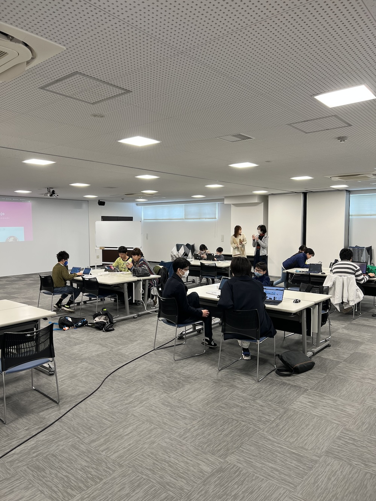
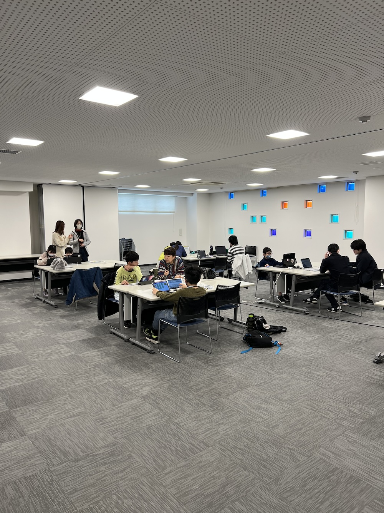
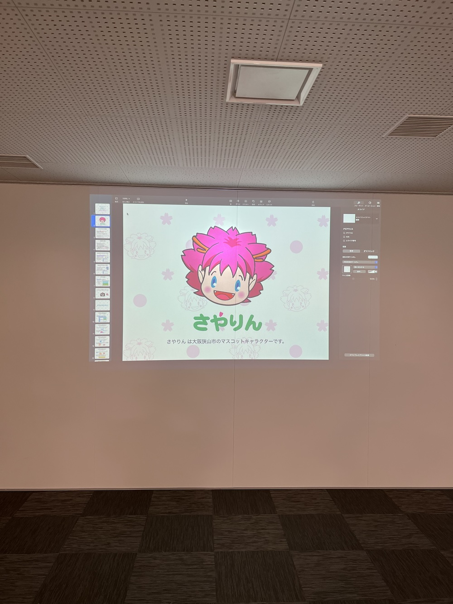
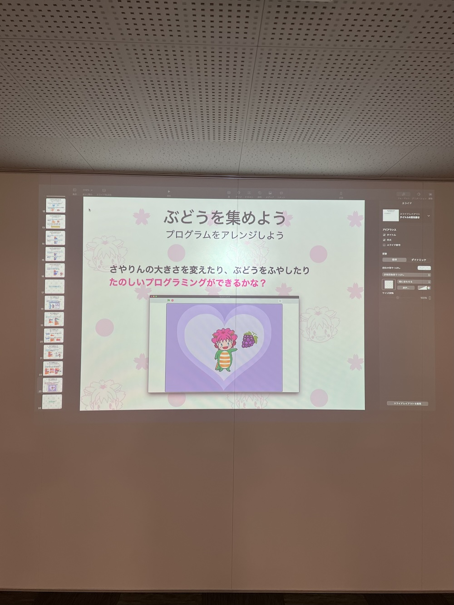
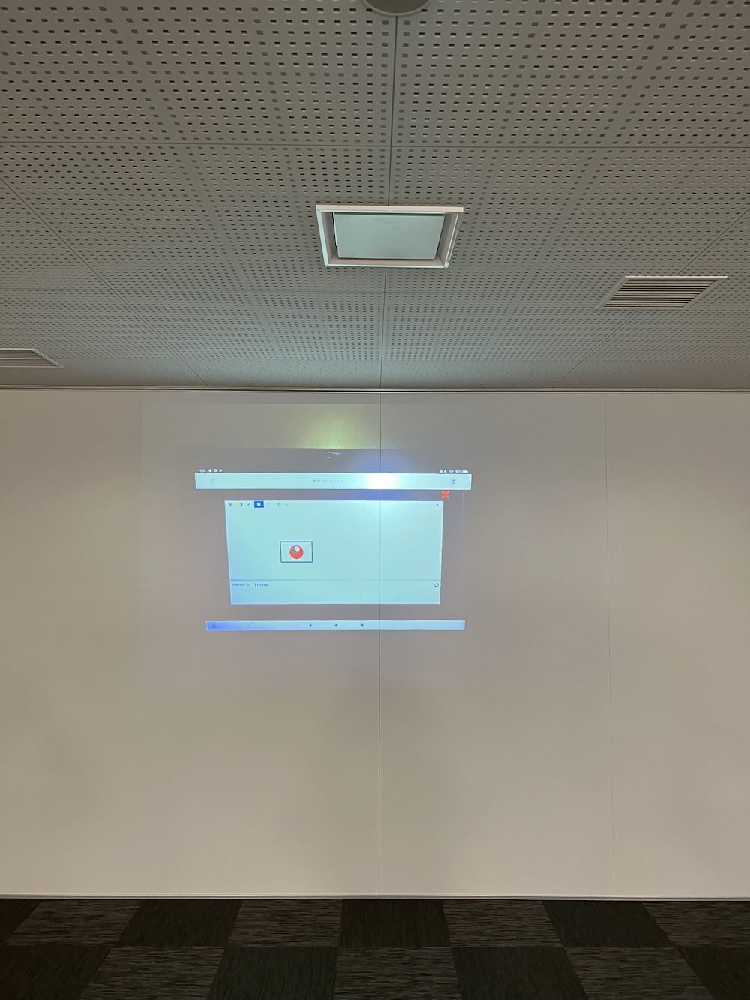

[子ども向けプログラミング道場：コーダー道場 73 回目 @大阪狭山](https://coderdojo-osakasayama.doorkeeper.jp/events/169667)

`2`名の **メンター** と`9`名の **ニンジャ** が集まりました。

会場は「[UP っぷ(子育て支援・世代間交流センター)](http://www.city.osakasayama.osaka.jp/kosodate_kyoiku/kosodate/upp_kosodatesiensedaikankouryuusenta1/index.html)」にて開催させていただきました。

## 当日のスケジュール ⏰

| 時間                   | 内容                          |
| ---------------------- | ----------------------------- |
| 9:30 - 9:40 (10 min)   | オープニング                  |
| 9:40 - 10:50 (70 min)  | プログラミング ワークショップ |
| 10:50 - 11:00 (10 min) | 休憩                          |
| 11:00 - 11:30 (30 min) | プログラミング                |
| 11:30 - 11:50 (20 min) | 発表                          |
| 11:50 - 12:00 (10 min) | クロージング                  |

## レポート 📝

### オープニング

大阪狭山は[2019 年 2 月に 1 回目](https://coderdojo-hommachi.github.io/blog/2019-02-24-report1/)の開催があり 5 年目になります。

2 月は わくフェス のイベントに出展していたのでスキップしました。

わくフェス で興味をもってくれた子供達が参加してくれています。

### プログラミング ワークショップ

5 周年の企画で さやりん のプログラミングワークショップ をしています。

プロジェクターでプログラミングの解説をしたので、子供達がどんなことをしているか大人も知れてよかったようです。

### 発表

#### 発表１

Python で絵を描くプログラミングです。

赤い円をだんだん小さく描くことで、日本の国旗が完成します。

コードのプログラミングも Python だとブロックで表現するので Scratch と親和性があります。

#### 発表２

Scratch の音楽のプログラミングです。

気に入った曲を打ち込みができて楽しそうです。

絵も付けれるのでオリジナルのミュージックプレイヤーになります。

#### 発表３

Scratch の さやりん のワークショップのアレンジです。

ぶどうの集めた数でメッセージが変わります。（背景が狭山池になっています。）

好物のぶどうに囲まれて幸せそうです。（ぶどうは狭山の名産です。）

#### 発表４

昔の携帯電話のハックです。

ドコモのキッズ携帯のようです。（この位の大きさが好きです。）

電源を入れた後に、電源スイッチを連打するとデバックモードになります。

### クロージング

館長からの挨拶です。6 年目もよろしくお願いします。

