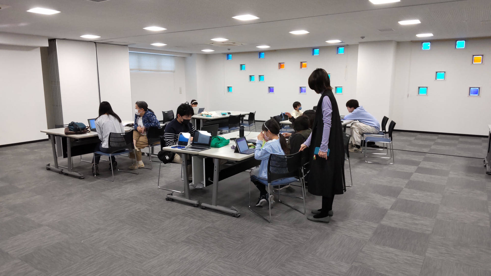
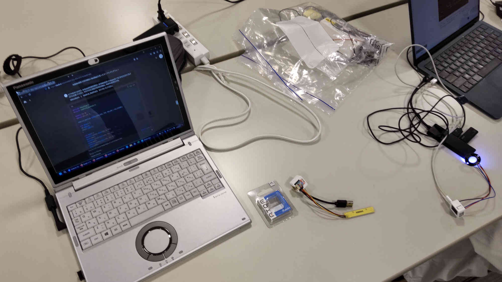
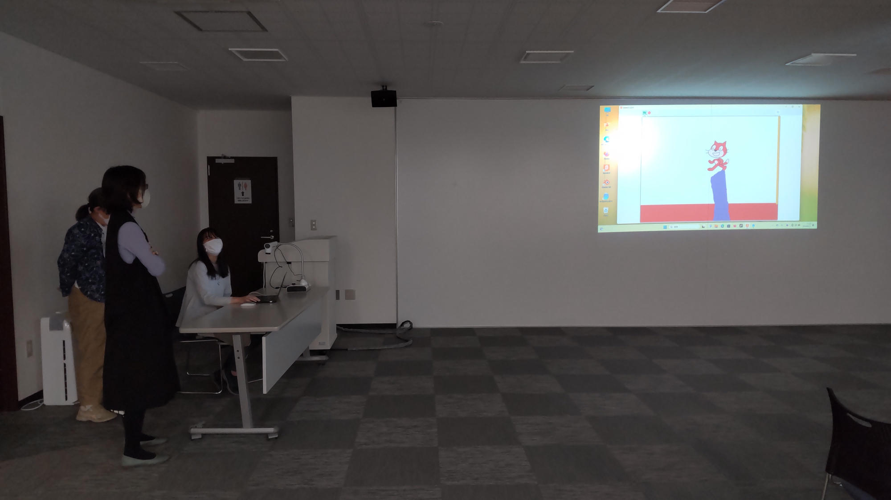
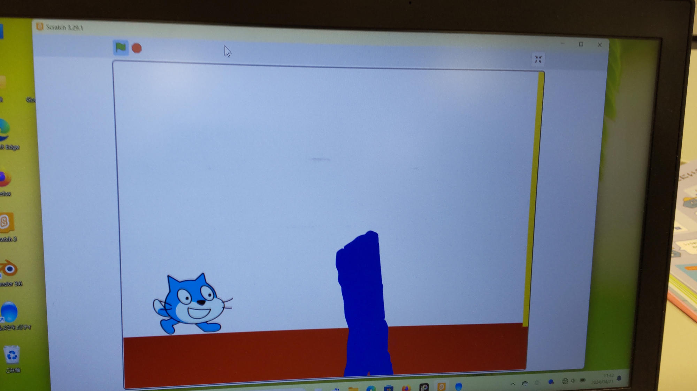
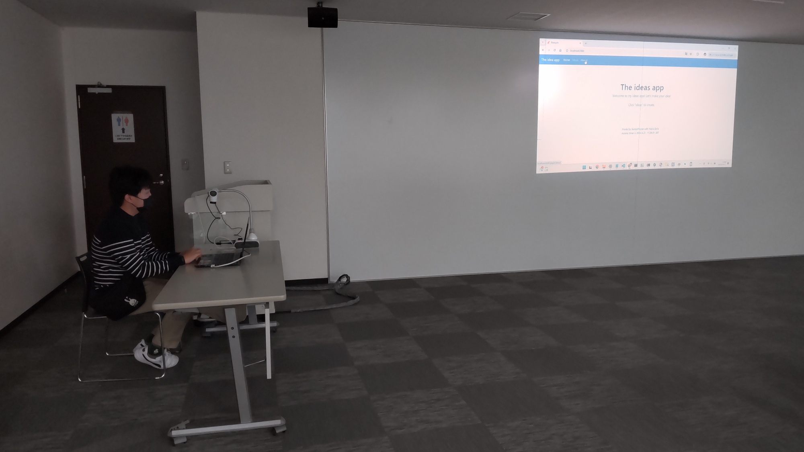
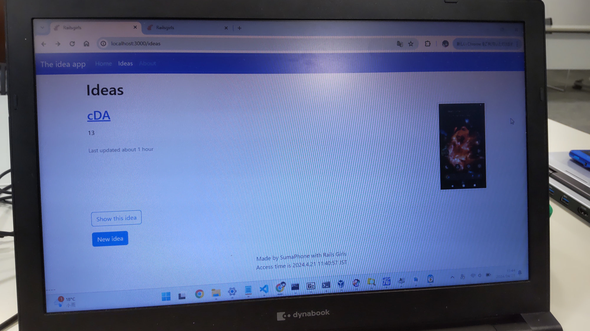

[子ども向けプログラミング道場：コーダー道場 74 回目 @大阪狭山](https://coderdojo-osakasayama.doorkeeper.jp/events/171244)

`2`名の **メンター** と`7`名の **ニンジャ** が集まりました。

会場は「[UP っぷ(子育て支援・世代間交流センター)](http://www.city.osakasayama.osaka.jp/kosodate_kyoiku/kosodate/upp_kosodatesiensedaikankouryuusenta1/index.html)」にて開催させていただきました。

## 当日のスケジュール ⏰

| 時間                   | 内容           |
| ---------------------- | -------------- |
| 9:30 - 9:40 (10 min)   | オープニング   |
| 9:40 - 10:50 (70 min)  | プログラミング |
| 10:50 - 11:00 (10 min) | 休憩           |
| 11:00 - 11:30 (30 min) | プログラミング |
| 11:30 - 11:50 (20 min) | 発表           |
| 11:50 - 12:00 (10 min) | クロージング   |

## レポート 📝

メンターや会場の方々が協力して開催できる素敵な場所です。

### プログラミング

メンターがわからないところもニンジャ同士で協力してがんばってくれました。

### 発表

#### 発表１

Scratch のアクションゲームです。

#### 発表２

Ruby on Rails の写真共有サービスです。

