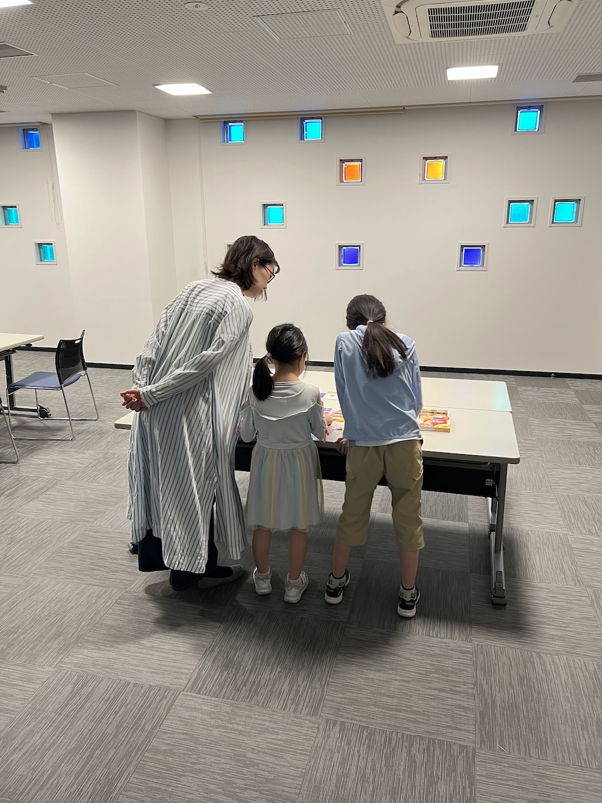
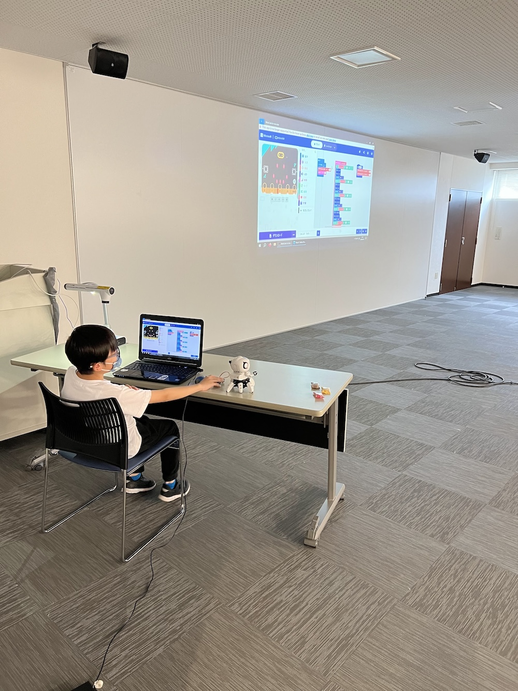

[子ども向けプログラミング道場：コーダー道場 75 回目 @大阪狭山](https://coderdojo-osakasayama.doorkeeper.jp/events/172614)

`3`名の **メンター** と`5`名の **ニンジャ** が集まりました。

会場は「[UP っぷ(子育て支援・世代間交流センター)](http://www.city.osakasayama.osaka.jp/kosodate_kyoiku/kosodate/upp_kosodatesiensedaikankouryuusenta1/index.html)」にて開催させていただきました。

## 当日のスケジュール ⏰

| 時間                   | 内容           |
| ---------------------- | -------------- |
| 9:30 - 9:40 (10 min)   | オープニング   |
| 9:40 - 10:50 (70 min)  | プログラミング |
| 10:50 - 11:00 (10 min) | 休憩           |
| 11:00 - 11:30 (30 min) | プログラミング |
| 11:30 - 11:50 (20 min) | 発表           |
| 11:50 - 12:00 (10 min) | クロージング   |

## レポート 📝

### プログラミング

メンターが RubyKaigi で沖縄に行っていたので、お土産があります。

AtomS3 でネオピクセルを光らせています。（とても小さいですが通信機能もあります。）

### 発表

#### 発表１

メンターが [RubyKaigi 2024](https://rubykaigi.org/2024/) に参加した話をします。沖縄県で開催されました。

首里城公園には、シャム猫がたくさんいて癒されたようです。

RubyKaigi は Ruby 言語の国際会議で開発者やコントリビュータなど 1400 人が集まりました。

#### 発表２

Scrach のアニメーションです。今回は _ぎゅっと_ 集合した状態で発表です。

アニメーションの他に子供達がキャラクターの声優にチャレンジしています。

発表が終わって、お土産のステッカーを選んでいます。

#### 発表３

Scrach のアクションゲームです。ネコはゲーミングで点滅しています。

なめらかな横スクロールで、ジャンプで落下処理も実装されています。

アリは敵キャラのようですが、当たり判定は未実装でした。（これからの開発が楽しみ）

#### 発表４

micro:bit のロボットとコントローラーです。以前の発表の再演です。

コントローラーで操作して、音楽も鳴るようにプログラミングされています。

ロボットは子供達に人気で、特に micro:bit が 2 つで通信できることに驚いています。

#### 発表５

Fusion360 のモデリングです。ある PV に登場するアイテムだそうです。

光線銃ですが、新しいようで懐かしい感じがします。

内部の機構も設計していて、レーザーポインターとして使うそうです。

### クロージング

会場からのお知らせです。楽器づくりのイベントです。（つくまな な感じがします。）

