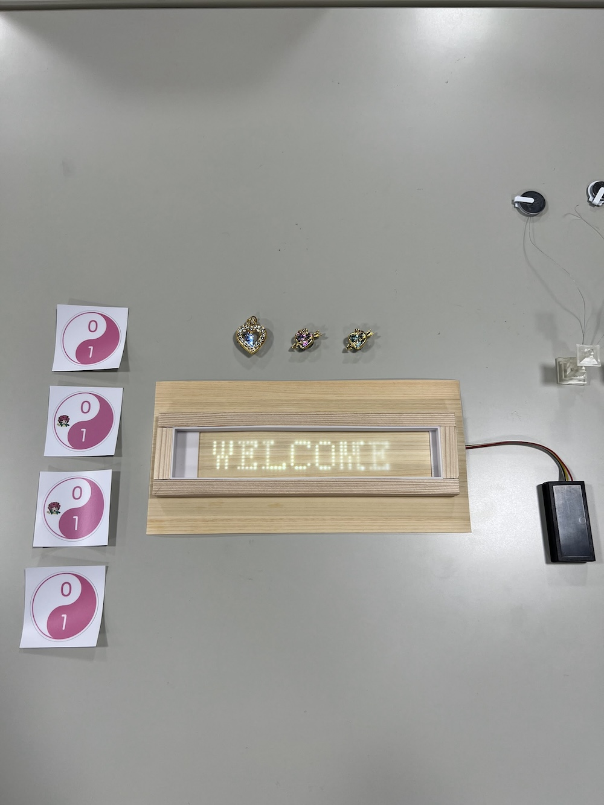
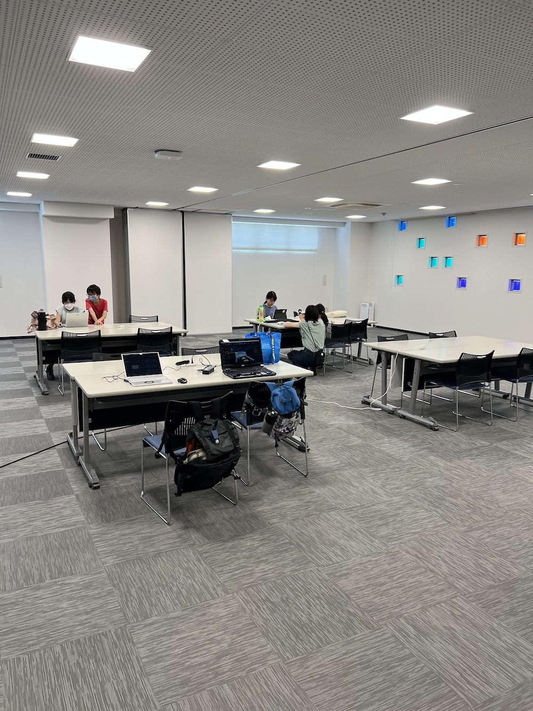
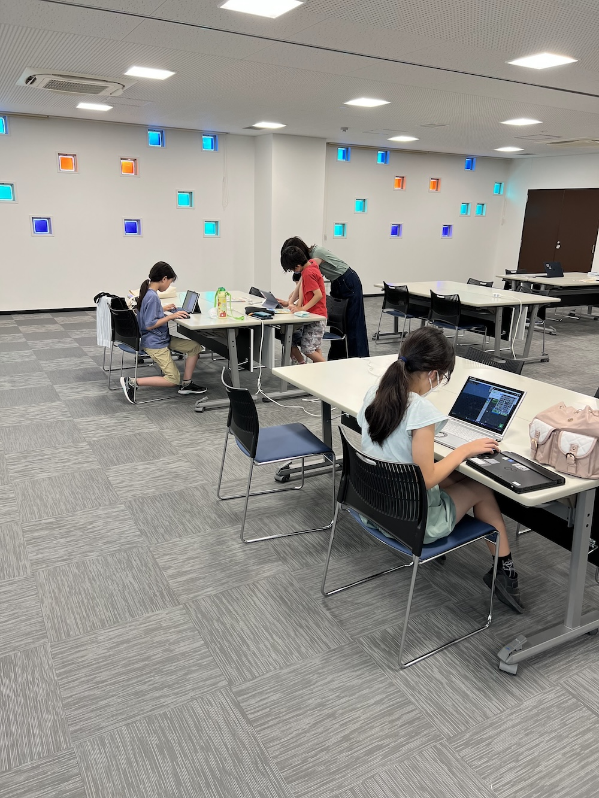
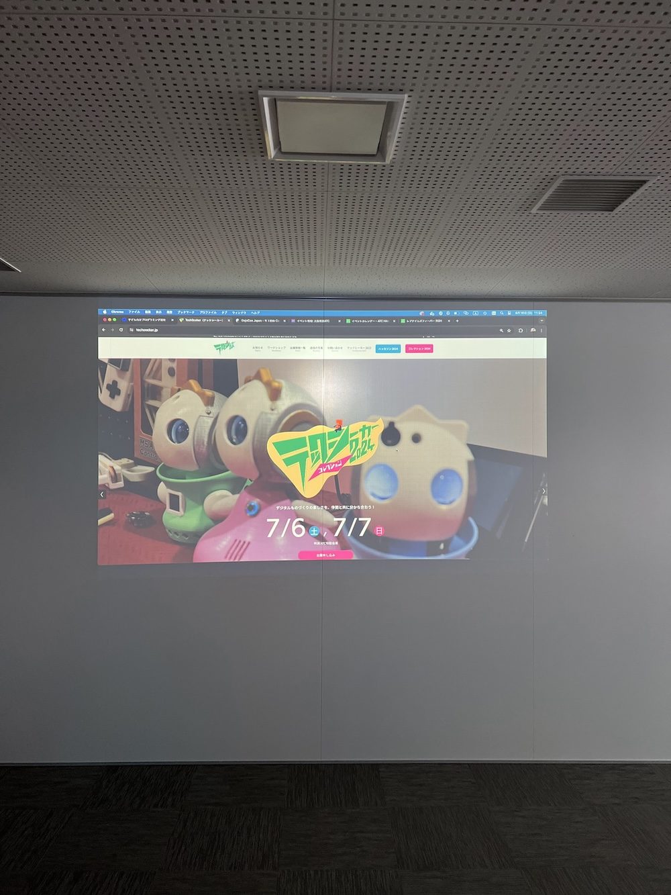
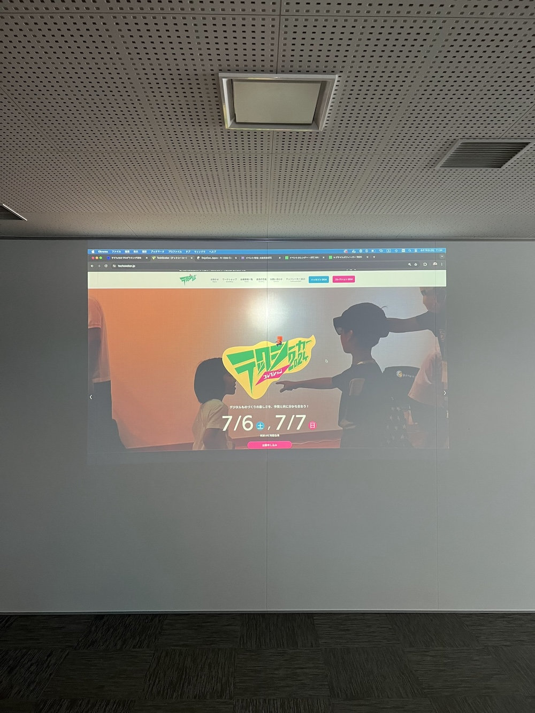
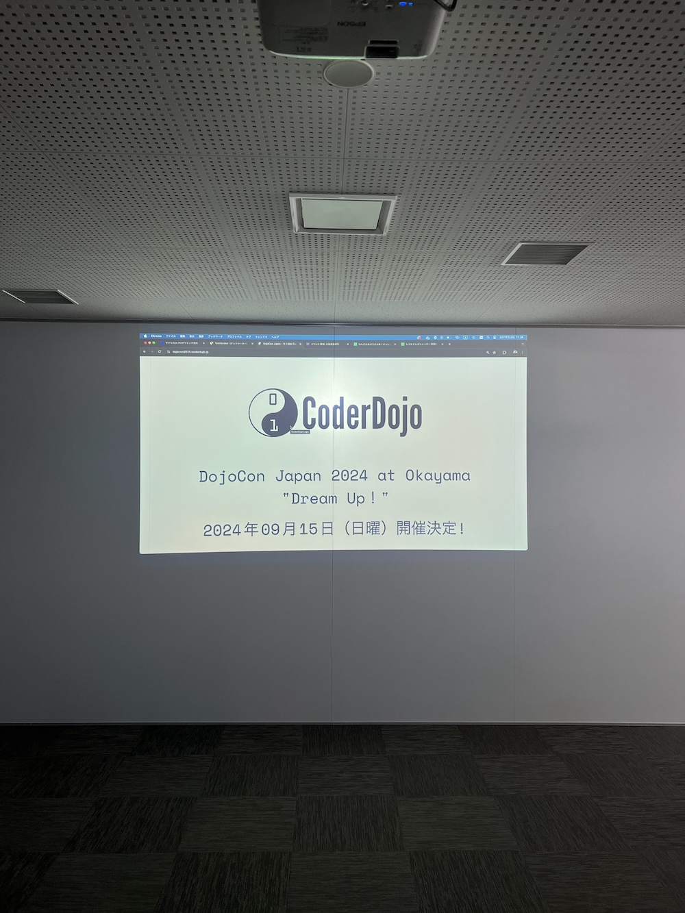
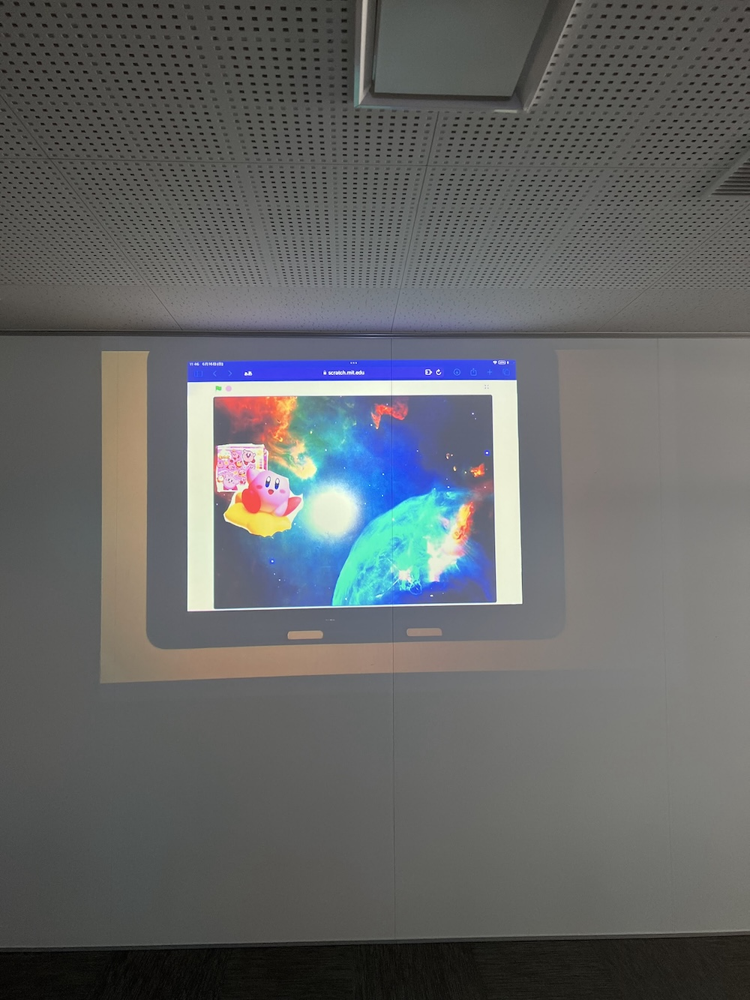
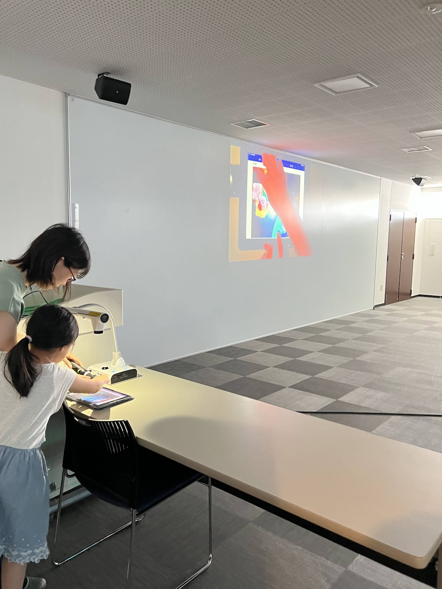
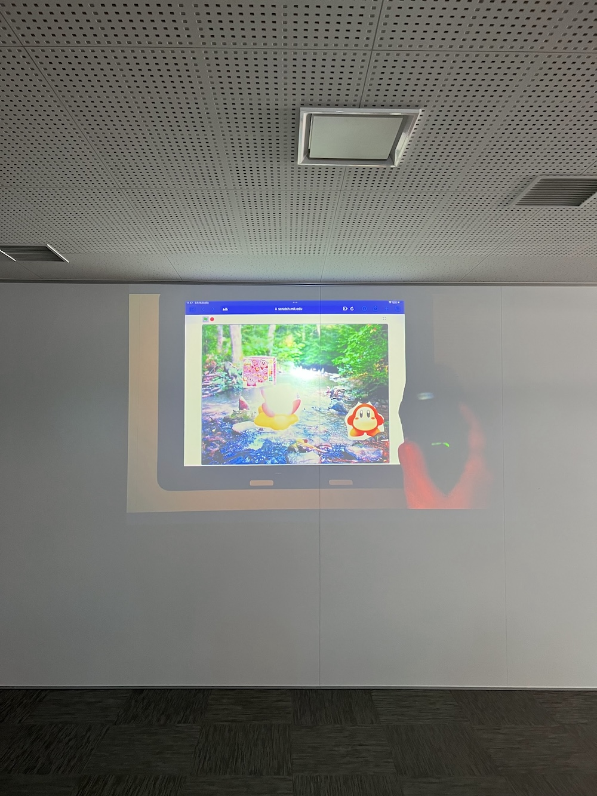
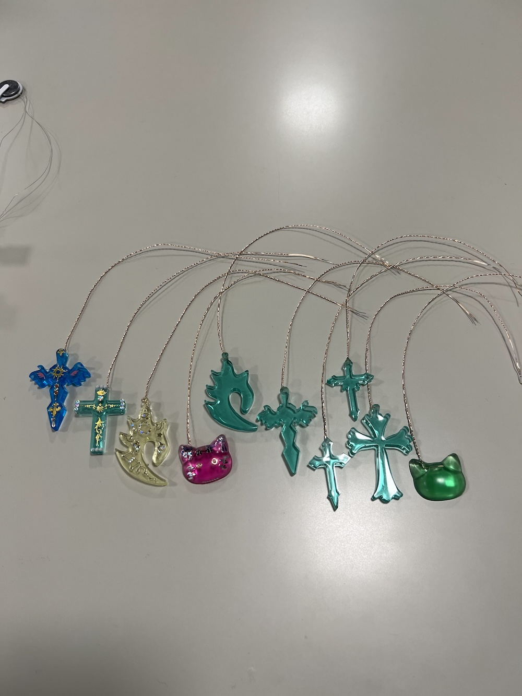

[子ども向けプログラミング道場：コーダー道場 75 回目 @大阪狭山](https://coderdojo-osakasayama.doorkeeper.jp/events/173762)

`3`名の **メンター** と`4`名の **ニンジャ** が集まりました。

会場は「[UP っぷ(子育て支援・世代間交流センター)](http://www.city.osakasayama.osaka.jp/kosodate_kyoiku/kosodate/upp_kosodatesiensedaikankouryuusenta1/index.html)」にて開催させていただきました。

## 当日のスケジュール ⏰

| 時間                   | 内容           |
| ---------------------- | -------------- |
| 9:30 - 9:40 (10 min)   | オープニング   |
| 9:40 - 10:50 (70 min)  | プログラミング |
| 10:50 - 11:00 (10 min) | 休憩           |
| 11:00 - 11:30 (30 min) | プログラミング |
| 11:30 - 11:50 (20 min) | 発表           |
| 11:50 - 12:00 (10 min) | クロージング   |

## レポート 📝

### オープニング

マイクラをする参加者が多くなっています。

### プログラミング

マイクラカップに申し込む前に、メンターの PC で体験しています。

### 発表

#### 発表１

メンターが参加するイベントの紹介です。

[テックシーカーコレクション 2024](https://techseeker.jp/) に出展します。

[DojoCon Japan 2024 at Okayama](https://dojocon2024.coderdojo.jp/) に参加します。

#### 発表２

Scrach のアニメーションの続編です。

タブレットの発表は書画カメラが活躍します。

今回は宇宙から地上に遊びに来ています。キャラクターも増えました。

### クロージング

[テックシーカーコレクション](https://techseeker.jp/workshop/) で電子工作のワークショップを開催します。

