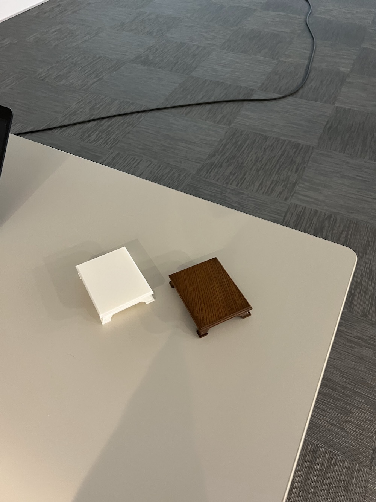

[子ども向けプログラミング道場：コーダー道場 77 回目 @大阪狭山](https://coderdojo-osakasayama.doorkeeper.jp/events/175282)

`3`名の **メンター** と`7`名の **ニンジャ** が集まりました。

会場は「[UP っぷ(子育て支援・世代間交流センター)](http://www.city.osakasayama.osaka.jp/kosodate_kyoiku/kosodate/upp_kosodatesiensedaikankouryuusenta1/index.html)」にて開催させていただきました。

## 当日のスケジュール ⏰

| 時間                   | 内容           |
| ---------------------- | -------------- |
| 9:30 - 9:40 (10 min)   | オープニング   |
| 9:40 - 10:50 (70 min)  | プログラミング |
| 10:50 - 11:00 (10 min) | 休憩           |
| 11:00 - 11:30 (30 min) | プログラミング |
| 11:30 - 11:50 (20 min) | 発表           |
| 11:50 - 12:00 (10 min) | クロージング   |

## レポート 📝

### オープニング

夏休みが始まりました。外は暑いですが館内は快適に過ごせます。

### プログラミング

M5Stack AtomS3 で電子工作の試作をしています。夏休みは時間があるので作品が楽しみです。

大阪狭山 は保護者が近くにスタイルが定着しています。また、以前のスタイルに戻ってもよさそう。

### 発表

#### 発表１

テクノ図工部の[TechSeeker2024:活動レポート](https://www.tekunozukoubu.net/2024/07/14/techseeker2024/) です。素敵な作品がたくさんありました。

[DojoCon Japan 2024](https://dojocon2024.coderdojo.jp/) の紹介です。岡山県の開催なので、大阪府からは近いです。

ついに **CoderDojo なかもず** がはじまります。ロゴは前方後円墳です。ヘレンさん承認ありがとうございます。

#### 発表２

メンターの 3D モデリングの作品です。盆栽の飾り台です。

目測とノギスで 3D スキャナーのように正確に複製ができています。

飾り台はワイヤレス給電の送電に使われます。1.5V -> 5.0V -> 12.0V -> 4.9V と電圧が変わります。

#### 発表３

Scratch のアクションゲームです。落ちてくる塊を手でキャッチします。

Nebula の背景が綺麗です。手のスプライトも背景といい感じにマッチしています。

スコアが 100 を超えるとゲームが終了するようにプログラミングされています。

### クロージング

街のイベントの夏休み特別企画で、手づくりワークショップを開催します。

TechSeeker2024 でも人気のネコで、かわいいストラップを作ります。

