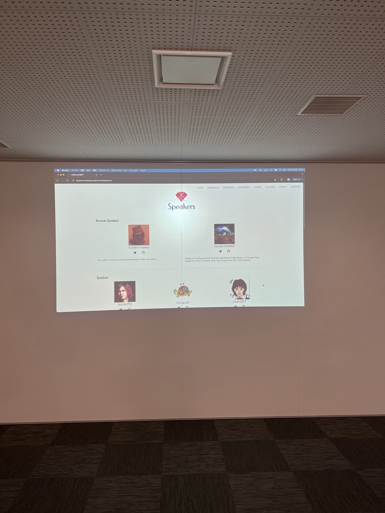
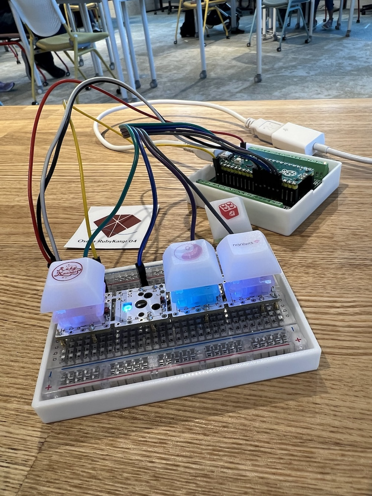

[子ども向けプログラミング道場：コーダー道場 78 回目 @大阪狭山](https://coderdojo-osakasayama.doorkeeper.jp/events/176018)

`3`名の **メンター** と`4`名の **ニンジャ** が集まりました。

会場は「[UP っぷ(子育て支援・世代間交流センター)](http://www.city.osakasayama.osaka.jp/kosodate_kyoiku/kosodate/upp_kosodatesiensedaikankouryuusenta1/index.html)」にて開催させていただきました。

## 当日のスケジュール ⏰

| 時間                   | 内容           |
| ---------------------- | -------------- |
| 9:30 - 9:40 (10 min)   | オープニング   |
| 9:40 - 10:50 (70 min)  | プログラミング |
| 10:50 - 11:00 (10 min) | 休憩           |
| 11:00 - 11:30 (30 min) | プログラミング |
| 11:30 - 11:50 (20 min) | 発表           |
| 11:50 - 12:00 (10 min) | クロージング   |

## レポート 📝

### オープニング

外は暑いですが、館内は冷房が効いて涼しいです。

### 展示

CoderDojo なかもず のチラシができました。ロゴは前方後円墳です。

大阪 Ruby 会議 04 の限定アイテムの光イヤーカフです。ステッカーもできました。

さやま・で・まるしぇ の限定アイテムの光ペンダントとカランコロンです。

### プログラミング

Fusion360 でモデリングをしています。黄色い貯金箱を作っているようです。

M5Stack AtomS3 で電子工作をしています。ネオピクセルで光る何かを作っているようです。

### 発表

#### 発表１

CoderDojo なかもず の[サイト](https://coderdojo-nakamozu.connpass.com/)が公開されました。 10 月にプレイベントがあります。

ブレークアウトボードとブレッドボードの自作キーボードです。キーキャップにはコミュティのロゴが印刷されています。

PicoRuby の PRK Firmware でプログラミングしています。DIY-keyboard firmware framework です。

今週末に中之島会館で [大阪 Ruby 会議 04](https://rubykansai.github.io/osaka04/) が開催されます。

PicoRuby の作者のキーノートやたくさんの講演があります。

### クロージング

午後から CoderDojo 梅田 で発表しました。発表者が 10 人もいて賑やかです。

この自作キーボードは 大阪 Ruby 会議 04 で展示します。

当日は Raspberry Pi Pico と PicoRuby でデモをします。

