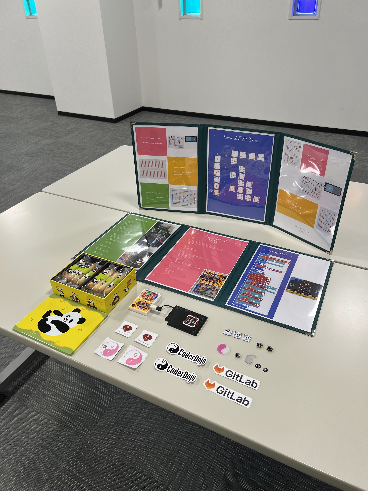
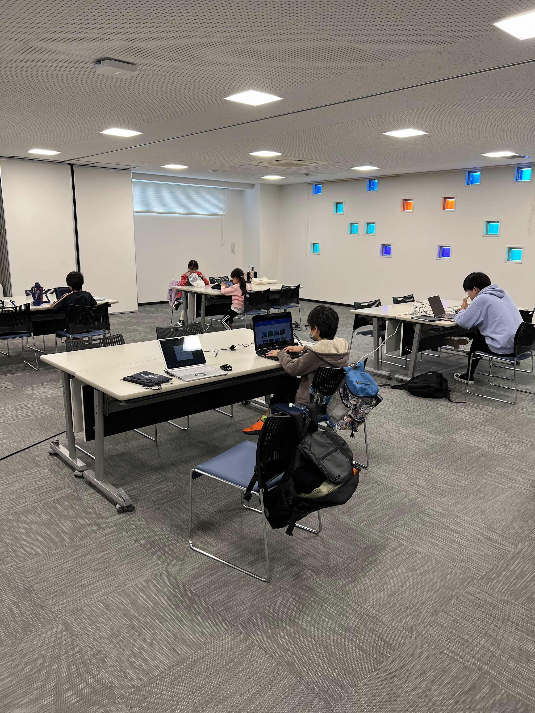
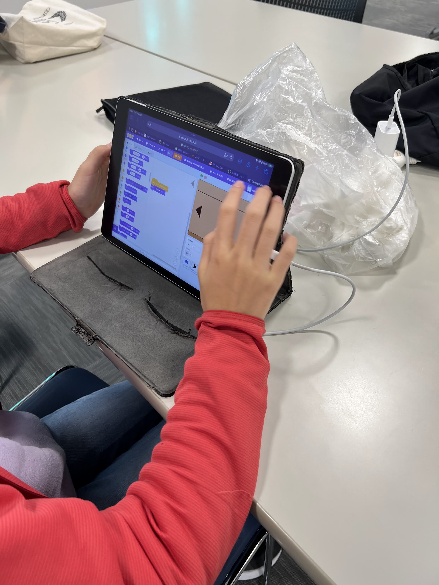
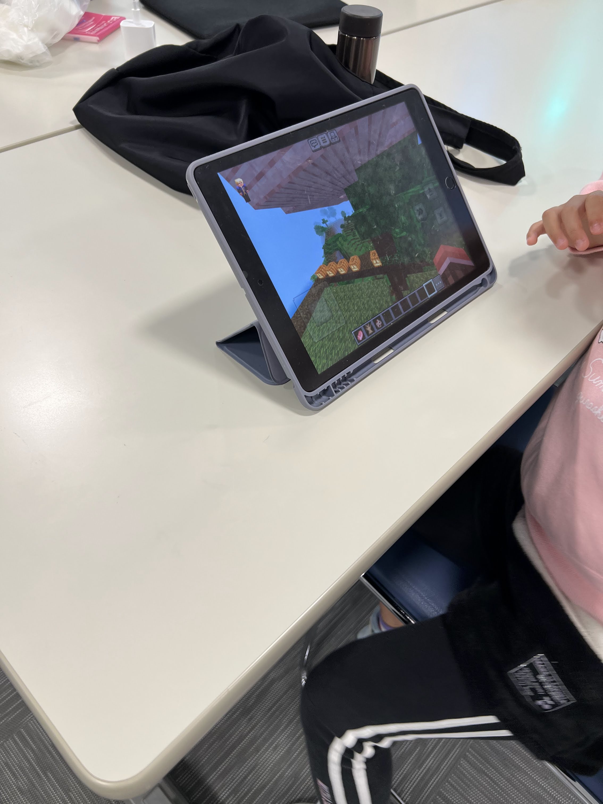
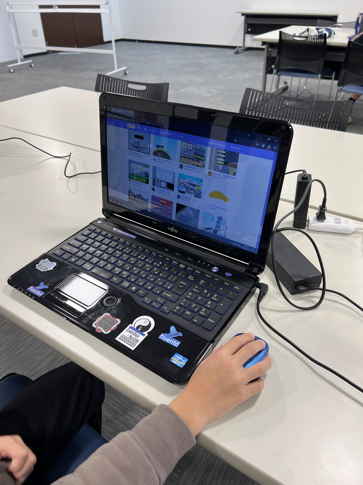
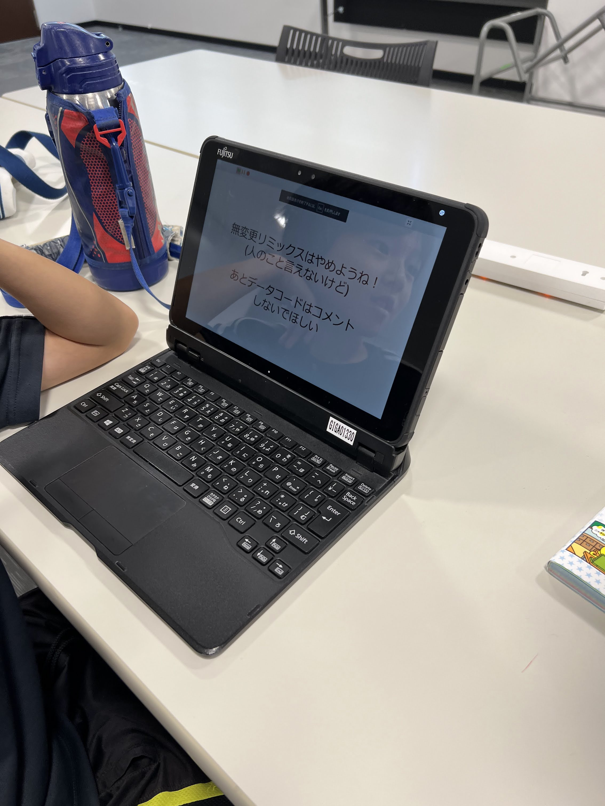
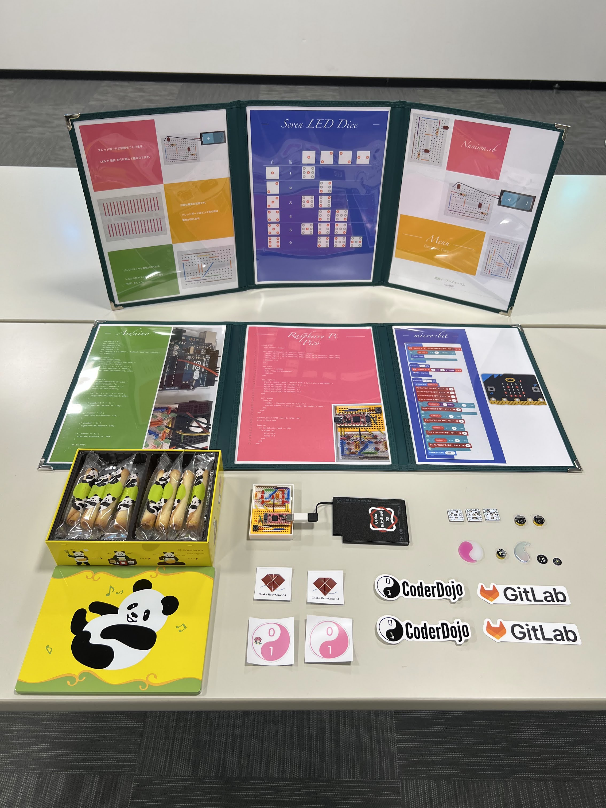

[子ども向けプログラミング道場：コーダー道場 79 回目 @大阪狭山](https://coderdojo-osakasayama.doorkeeper.jp/events/179183)

`3`名の **メンター** と`5`名の **ニンジャ** が集まりました。

会場は「[UP っぷ(子育て支援・世代間交流センター)](http://www.city.osakasayama.osaka.jp/kosodate_kyoiku/kosodate/upp_kosodatesiensedaikankouryuusenta1/index.html)」にて開催させていただきました。

## 当日のスケジュール ⏰

| 時間                   | 内容           |
| ---------------------- | -------------- |
| 9:30 - 9:40 (10 min)   | オープニング   |
| 9:40 - 10:50 (70 min)  | プログラミング |
| 10:50 - 11:00 (10 min) | 休憩           |
| 11:00 - 11:30 (30 min) | プログラミング |
| 11:30 - 11:50 (20 min) | 発表           |
| 11:50 - 12:00 (10 min) | クロージング   |

## レポート 📝

### オープニング

会場が利用できないなどあり、2 ヶ月ぶりの CoderDojo です。すっかり秋になりました。

### プログラミング

Scratch で脱出ゲームを作っています。

Minecraft をタブレットで操作しています。

Scratch で共有された作品を見ています。

Scratch は「無変更リミックスはやめようね！」のマナーがあるようです。

### 発表

発表を見る前に退出したので、写真は無いです。

### クロージング

12/08(日) の CoderDojo 大阪狭山 は [CoderDojo なかもず](https://coderdojo-nakamozu.connpass.com/event/330879/) と合同で開催します。

ちょこっとプレゼンテーションに参加して、プレゼントをゲットしましょう！
